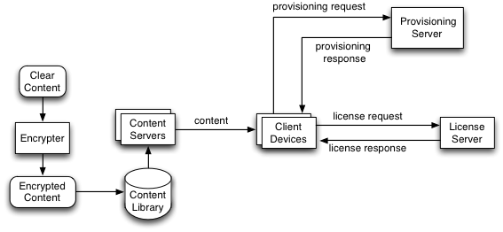

# MediaDRM NexPlayerSDK for Android

MediaDrm is a module provided by Google used to restrict usage of proprietary hardware and copyrighted DASH
content. This module is available from Android 4.3 JELLY_BEAN_MR2 and up.
MediaDrm can be used to obtain keys for decrypting protected media streams, in conjunction with MediaCrypto
provided by Google. The MediaDrm APIs are designed to support the ISO/IEC 23001-7: Common Encryption
standard, but may also be used to implement other encryption schemes.

### MediaDrm Components



Encrypted content is prepared using an encryption server and stored in a content library. The encrypted content is streamed or downloaded from the content library to client devices via content servers. Licenses to view the content are obtained from the License Server.

NexPlayer provides some wrapping classes to the users for more convenience using Media DRM and Media Crypto
classes. Find more information about MediaDrm on the Android Development website (https://developer.android.com/reference/android/media/MediaDrm.html).


In the beginning, the app calls open() of NexPlayer with a url encrypted content of DASH. NexPlayer invokes openSession() and adds keys provided by the key server. Then, the content is decrypted.

When closing NexPlayer, it will call closeSession internally and you don’t need to call closeSession.

### The APIs

NexPlayer provides APIs to set MediaDRM information such as the key server’s URL or optional parameters. These
APIs should be called before calling NexPlayer.Open().

```java
public void setNexMediaDrmKeyServerUri(String keyUri)
```

This API is used for setting the Key Server’s URL to obtain keys to decrypt encrypted content.

```java
public void setOfflineKeyListener(IOfflineKeyListener OfflineKeyListener)
```

This API is used for registering Offline Key listener for managing offline keys. Here is the detailed information of
IOfflineKeyListener.

```java
public interface IOfflineKeyListener
{
	void onOfflineKeyStoreListener(NexPlayer mp, byte[] keyId);
	byte[] onOfflineKeyRetrieveListener(NexPlayer mp);
}
```

```java
public void setNexMediaDrmOptionalHeaderFields(HashMap<String, String>
optionalHeaderFields)
```

This API is used for setting optionalParameters when sending requests to the Key Server.

### How to play MediaDrm content

1. Initialize NexPlayer and NexALFactory.
2. Set Key server’s URL using “setNexMediaDrmKeyServerUri” API.
3. (Optional) If you need to store or play offline content, then you should implement IOfflineKeyListener and then
    register it using “setOfflineKeyListener” API.
4. (Optional) If your key server needs more information, then you can set it using “setNexMediaDrmOptional-
    HeaderFields” API.
5. Open the content.
6. NexPlayer will get credentials from the Key Server, and then play content automatically.

### How to store and retrieve Media DRM content

To play MediaDrm content without internet connection, you should store the content before playback. If the user
enables storing mode, then NexPlayer will request a specified KeyID from MediaDRM and pass it through an event
listener. The user MUST store it using his/her own way such as saving it in a database.

NexPlayer provides 2 ways for storing content –refer to the following instructions.

1. Storing with playback
You can save content during playback. In this mode, NexPlayer will store the content you see on the screen, so if you skip anysections, NexPlayer will not store those sections.

	- Register an HTTP Store callback:
    
	    ```java
	    HTTPStoreDataManager.initManagerMulti(Object nexPlayerHandle, String strEngineLibName, String cachFolder);
	    ```
	   NexPlayer will store cache files under “cachFolder”.
	   
	- Register IOfflineKeyListener:
	
		```java
	    void onOfflineKeyStoreListener(NexPlayer mp, byte[] keyId);
	    ```
	   A generated KeyID will be sent by this listener method. You should store it in your own way.
	   
	- Open the URL and play content.
		
		```java
		 public int open(String path, String smiPath, String externalPDPath, int type, int transportType)
		```
		The 4th param, “type” should be “NEXPLAYER_SOURCE_TYPE_STREAMING“.


2. Storing WITHOUT playback
    In this mode, NexPlayer will store every content in sequence.

	- Register an HTTP Store callback:
    
	    ```java
	    HTTPStoreDataManager.initManagerMulti(Object nexPlayerHandle, String strEngineLibName, String cachFolder);
	    ```
	   NexPlayer will store cache files under “cachFolder”.
	   
	- Register IOfflineKeyListener:
	
		```java
	    void onOfflineKeyStoreListener(NexPlayer mp, byte[] keyId);
	    ```
	   A generated KeyID will be sent by this listener method. You should store it in your own way.
	   
	- Open the URL and play content.
		
		```java
		 public int open(String path, String smiPath, String externalPDPath, int type, int transportType)
		```
		The 4th param, “type” should be “NEXPLAYER_SOURCE_TYPE_STORE_STREAM“.
		
**Retrieving stored content from cache files**

To play stored MediaDrm files, you should register a retrieve callback function and recover a DRM session via
KeyID.

1. Register an HTTP Retrieve callback:

	```java
	HTTPRetrieveDataManager.initManagerMulti(Object nexPlayerHandle, String strEngineLibName, String cachFolder);
	```
	
	NexPlayer will find cached data from “cachFolder”.

2. Register IOfflineKeyListener:

	```java
	byte[] onOfflineKeyRetrieveListener(NexPlayer mp);
	```
	
	When NexPlayer restores a DRM session, and retrieving callback is enabled, NexPlayer will trigger this callback to acquire KeyID that is provided via onOfflineKeyStoreListener.

3. Open the URL and play content.

	```java
	public int open(String path, String smiPath, String externalPDPath, int type, int transportType)
	```
	
	The 4th param, “type” should be “NEXPLAYER_SOURCE_TYPE_STREAMING“.


## New Offline Playback

The new offline playback feature is an expansion, which is a better way of saving and managing the data required
for offline playback storing than a database. For more details, refer to Section Storing Streaming Content for Offline
Playback.

In the new offline playback, every storing step will create a file that contains stored info instead of a database. Using
this file and calling this API once will enableContinue Store and Retrieve.

> **Note** The new offline playback does not support storing and playing content simultaneously. If you wish to do both actions, please use the previous offline playback method.

### How To Store Media DRM Content

1. Initialize NexPlayer and NexALFactory.
2. Create an instance of NexOfflineStoreController.
3. Set the Key server URL using setOfflineStoreSetting API.
4. Implement IOfflineKeyListener and then register it by using setOfflineKeyListener API.
5. Register IOfflineStoreListener using NexOfflineStoreController.setListener().
6. Call startOfflineStore ().
7. NexOfflineStoreController will get credentials from the Key Server, and then store content automatically.

To store media DRM content and then to retrieve, the user needs the same offline key ID from storing. Therefore,
the user must store the ID in the stored info file to retrieve and playback offline successfully.

To playback offline any stored media DRM content, pass the offline key ID to the instance of NexOfflineStoreController by using setOfflineStoreSetting API.

```java
@Override
public void onOfflineKeyStoreListener(NexPlayer mp, byte[] keyId) {
	if ( keyId != null ) {
		NexOfflineStoreController.setOfflineStoreSetting(
		NexPlayer.NexOfflineStoreSetting.STRING_OFFLINE_KEY_ID,
		Base64.encodeToString(keyId, Base64.DEFAULT));
	}
}
```

### How To Retrieve Media DRM Content

1. Initialize NexPlayer and NexALFactory.
2. Implement IOfflineKeyListener and then register it using setOfflineKeyListener API.
3. Call open () or openFD () to open media.
4. NexPlayer will get credentials from the Key Server, and then play content automatically.

The user must decode the saved string data in the stored info file as a byte and return it to onOfflineKeyRetrieveListener. Refer to Section Obtaining Saved Data from the Stored Info File.

```java
@Override
public byte[] onOfflineKeyRetrieveListener(NexPlayer mp) {
	byte[] keyId = null;
	if( mStoreInfoFile != null ) {
		JSONObject obj = NexOfflineStoreInfoUtils.parseJSONObject(mStoreInfoFile);
		try {
			String sKeyId = obj.getString(
			NexOfflineStoreInfoUtils.
			STORE_INFO_KEY_OFFLINE_KEY_ID);
			if(sKeyId != null)
			keyId = Base64.decode(sKeyId, Base64.DEFAULT);
		} catch (JSONException e) {
			e.printStackTrace();
		}
	}
	return keyId;
}
```

