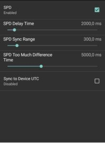

# Enabling Video Synchronization Feature

## What is Nexplayer's synchronization feature?

NexPlayer synchronization feature technology allows you to sync the video arrival and play/stream video synchronously across different devices using the DASH SPD value. This is also possible for HLS streams by controlling the SPD value from the client-side.

## How to enable synchronization feature in the sample application

To get started we need an apk and at least two devices.
Steps to enable Synchronization:


- Go to the three dots → Settings → SPD Settings.

Here we have several fields that depending on our needs we will have to configure.

**SPD:** Enabled (this field is used to enable and disable SPD).

- *Note:* The other fields will be enabled when you enable the SPD option.

**SPD Delay Time:** Value between 500.0 ms and 20,000.0ms (default 2000.0ms).

**SPD Sync Range:** Value between 100.0 ms and 2000.0ms (default 300.0ms).

**SPD Too Much Difference Time:** Value between 2000.0and 10,000.0 ms (default
5000.0ms).

**Sync to Device UTC:** Enable or disable. This field takes as reference the UTC time
(disabled by default).

  


Once we have configured what we need, we will play the content with SPD in the
section.

Streaming → GO TO URL (at the bottom) → put the URL in the “Stream URL

Synchronization feature is highly dependent on the internet speed and the configuration of the manifest.

### Limitations

- Only works with live content.
- Device time should be adjusted correctly, incorrect device time or setting it
manually might break the logic. This can be handledby using server time but
the synchronisation won’t be precise as device time as server time is given in
seconds, not in milliseconds as device time.
- Setting a very low SPD value for the stream might affect smooth playback
experience as it won’t allow the player to create enough buffer.


## How to enable synchronization feature from the code


NexPlayer synchronization can be enabled by setting the following property:


```java
mNexPlayer.setProperty(NexPlayer.NexProperty.ENABLE_SPD_SYNC_TO_GLOBAL_TIME, 1);
```


To set the SPD value from the client side for both DASH and HLS you can set the
SPD value per property ( ```SET_PRESENTATION_DELAY``` or 590) as shown below:

```java
mNexPlayer.setProperty (NexProperty.SET_PRESENTATION_DELAY,mPrefData.mSPDValue);
```

Note that if the value of ```SET_PRESENTATION_DELAY``` is too large, the player may not
find the delayed segment provided by the live content server.

### Advanced configuration


You can control the synchronization behaviour further by adjusting the below
properties.

#### ENABLE_SPD_SYNC_TO_DEVICE_TIME


Enables synchronization to device UTC for more accurate behaviour.

```java
mNexPlayer.setProperty(NexPlayer.NexProperty.ENABLE_SPD_SYNC_TO_DEVICE_TIME, 1);
```

Default: 0

Values:

- 0: Disabled device UTC
- 1: Enabled device UTC


#### SET_SPD_SYNC_DIFF_TIME

If the current playback is not more synchronized than this value, the player will speed
up playback and make sync.

```java
mNexPlayer.setProperty(NexPlayer.NexProperty.SET_SPD_SYNC_DIFF_TIME, 100);
```

Unit: msec (1/1000 sec)

Default: 300 (300 msec)

#### SET_SPD_TOO_MUCH_DIFF_TIME

If playback is out of sync than this value, the player will jump to synchronize the
video rather than make it by speeding.

```java
mNexPlayer.setProperty(NexPlayer.NexProperty.SET_SPD_TOO_MUCH_DIFF_TIME,5000);
```

Unit: msec (1/1000 sec)

Default: 5000 (5 seconds)

## Things to consider


- You should make sure suggestedPresentationDelay is present in DASH
manifest otherwise synchronisation won't work.
- For HLS, you should set ```SET_PRESENTATION_DELAY``` property as mentioned
above.
- You should make sure there is enough distance from the live edge to provide
a smooth playback which should be adjusted with *suggestedPresentationDelay* and ```SET_PRESENTATION_DELAY``` properties. If
there is not enough space to buffer from the live edge, playback might be
effected.
