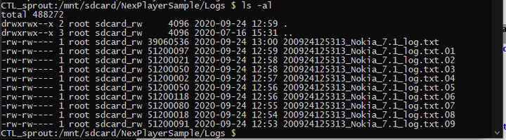

# NexPlayer Log2File

NexPlayer Log2File feature allows you to save logs on the device and making it easier to debug the playback process. 

## How to enable file logging?

NexPlayer logs can be saved into the device by enabling the following property:

```java
mNexPlayer.setProperty(NexPlayer.NexProperty.SET_LOGS_TO_FILE,
NexLogsToFile.NexFileLogPreset.FULL_LOGS.getIntegerCode());
```

## How to set log level?

Logging level can be set using the NexFileLogPreset:

* DEFAULT
* FOR_PROTOCOL
* FOR_ENGINE
* FOR_AUDIO
* FOR_VIDEO
* FOR_DRM
* FOR_CAPTION
* FULL_LOGS

## How to set file limits?

By default, each log file has a limit of 50MB and no more than 20 files are genereated. Files are rotated when the limit is reached. You can adjust these limit in NexPlayer.java:

```java
public int setProperty(NexProperty property, int value) {
	....

    if (Build.VERSION.SDK_INT >= Build.VERSION_CODES.LOLLIPOP) {
        if (null == mLogsToFile) {
            mLogsToFile = new NexLogsToFile.Builder(this)
                    .setPreset(NexLogsToFile.NexFileLogPreset.fromIntegerValue(value))
                    .seFileCount(20)
                    .seBufferSize(50_000)
                    .build();
        }
        mLogsToFile.run();
        return 0;
    } else {
        return -1;
    }
    
    ...
    
}
```

## Where are the log files?

Log files are saved under `/mnt/sdcard/NexPlayerSample/Logs/`

In the below output logs files are from the latest to the oldest : _log.txt → _log.txt.09 



### Things to consider

Writing logs to file might effect video performance and might lead to A/V synchronisation issues as it is an expensive operation. Please keep performace effects in mind when using this feature. 

## Properties

### SET_LOGS_TO_FILE (0x000D0000)

Enables to save the log files into the device.

By default this property is disabled.

In order to enable it, the property must be set with any of the values below:

- **Default:** Enables the basic logging level.
- **FOR_PROTOCOL:** Enables the protocol logging level.
- **FOR_ENGINE:** Enables the engine logging level.
- **FOR_AUDIO:** Enables logging related to audio.
- **FOR_VIDEO:** Enables logging related to video.
- **FOR_DRM:** Enables the DRM logging level.
- **FOR_CAPTION:** Enables the captioning logging level.
- **FULL_LOGS:** Enables the highest logging level.