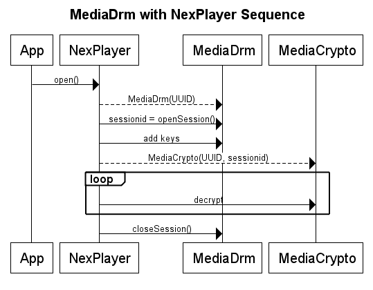

# MediaDRM NexPlayerSDK for Android


Encrypted content is prepared using an encryption server and stored in a content library. The encrypted content is streamed or downloaded from the content library to client devices via content servers. Licenses to view the content are obtained from the License Server.

NexPlayer provides some wrapping classes to the users for more convenience using Media DRM and Media Crypto classes. Find more information about MediaDrm on the [Android development website](https://developer.android.com/reference/android/media/MediaDrm.html).



In the beginning, the app calls open() of NexPlayer with a url encrypted content. NexPlayer invokes openSession() and adds keys provided by the key server. Then, the content is decrypted.

When closing NexPlayer, it will call closeSession internally and you don’t need to call closeSession.

### The APIs

NexPlayer provides APIs to set MediaDRM information such as the key server’s URL or optional parameters. These APIs should be called before calling NexPlayer.Open().

```java
public void setNexMediaDrmKeyServerUri(String keyUri)
```

This API is used for setting the Key Server’s URL to obtain keys to decrypt encrypted content.

```java
public void setOfflineKeyListener(IOfflineKeyListener OfflineKeyListener)
```

This API is used for registering Offline Key listener for managing offline keys. Here is the detailed information of
IOfflineKeyListener.

```java
public interface IOfflineKeyListener {
	void onOfflineKeyStoreListener(NexPlayer mp, byte[] keyId);
	byte[] onOfflineKeyRetrieveListener(NexPlayer mp);
}
```

```java
public void setNexMediaDrmOptionalHeaderFields(HashMap<String, String>
optionalHeaderFields)
```

This API is used for setting optionalParameters when sending requests to the Key Server.

### How to Play MediaDrm content

1. Initialize NexPlayer and NexALFactory.
2. Set Key server’s URL using `setNexMediaDrmKeyServerUri` API.
3. (Optional) If you need to store or play offline content, then you should implement IOfflineKeyListener and then register it using `setOfflineKeyListener` API.
4. (Optional) If your key server needs more information, then you can set it using `setNexMediaDrmOptionalHeaderFields` API.
5. Open the content.
6. NexPlayer will get credentials from the Key Server, and then play content automatically.

### How To Store MediaDrm Content

1. Initialize NexPlayer and NexALFactory.
2. Create an instance of NexOfflineStoreController.
3. Set the Key server URL using setOfflineStoreSetting API.
4. Implement IOfflineKeyListener and then register it by using setOfflineKeyListener API.
5. Register IOfflineStoreListener using NexOfflineStoreController.setListener().
6. Call startOfflineStore().
7. NexOfflineStoreController will get credentials from the Key Server, and then store content automatically.

To store MediaDrm content and then to retrieve, the user needs the same offline key ID from storing. Therefore, the user must store the ID in the stored info file to retrieve and playback offline successfully.

To playback offline any stored MediaDrm content, pass the offline key ID to the instance of NexOfflineStoreController by using setOfflineStoreSetting API.

```java
@Override
public void onOfflineKeyStoreListener(NexPlayer mp, byte[] keyId) {
	if ( keyId != null ) {
		NexOfflineStoreController.setOfflineStoreSetting(
		NexPlayer.NexOfflineStoreSetting.STRING_OFFLINE_KEY_ID,
		Base64.encodeToString(keyId, Base64.DEFAULT));
	}
}
```

### How To Retrieve MediaDrm Content

1. Initialize NexPlayer and NexALFactory.
2. Implement IOfflineKeyListener and then register it using setOfflineKeyListener API.
3. Call open() or openFD() to open media.
4. NexPlayer will get credentials from the Key Server, and then play content automatically.

The user must decode the saved string data in the stored info file as a byte and return it to onOfflineKeyRetrieveListener. Refer to Section Obtaining Saved Data from the Stored Info File.

```java
@Override
public byte[] onOfflineKeyRetrieveListener(NexPlayer mp) {
	byte[] keyId = null;
	if( mStoreInfoFile != null ) {
		JSONObject obj = NexOfflineStoreInfoUtils.parseJSONObject(mStoreInfoFile);
		try {
			String sKeyId = obj.getString(
			NexOfflineStoreInfoUtils.
			STORE_INFO_KEY_OFFLINE_KEY_ID);
			if(sKeyId != null)
			keyId = Base64.decode(sKeyId, Base64.DEFAULT);
		} catch (JSONException e) {
			e.printStackTrace();
		}
	}
	return keyId;
}
```

