# Getting Started

## Media Playback

Playback is controlled through the **NexPlayer**™ class, which handles acquisition and decoding of the media data.

The application creates an instance of this class and issues commands to it by calling instance methods. NexPlayer™ carries out these commands asynchronously and notifies the application of changes in status.

The application is also notified when NexPlayer™ needs a surface on which to display video or an audio track
object through which to play audio. The application must create the relevant objects when necessary or supply references to existing instances that NexPlayer™ can use. For more information, see the **onVideoRenderCreate**, **onVideoRenderRender**, **onVideoRenderDelete**, **onAudioRenderCreate**, and **onAudioRenderDelete** methods in **IVideoRendererListener** and **IListener**.

It is possible to set certain properties on the NexPlayer™ instance, which affect how media is played back, how audio/video synchronization is handled, which player features are enabled, and so on. In general, the default property settings are suitable for most applications. However, if you are developing a streaming media application that uses HLS (HTTP Live Streaming), you may want to adjust the buffering time.

For more information on properties, see **NexProperty**.

The application may also need to handle displaying of decoded frames, if the Java rendering method is being used. This is necessary to support Honeycomb. See **Honeycomb Support** for more details.

Notifications are handled through the **IListener** and **IVideoRendererListener** interfaces. The application must provide objects which implement these interfaces, and must call **setListener** and **IVideoRendererListener** to associate them with the NexPlayer™ instance.

> **Warning** This must be the first thing the application does after instantiating NexPlayer™, before calling any other methods.

Once the event listener and video rendering interfaces have been set up, the application may call methods on the NexPlayer™ object to control the media source. Certain calls, such as *open* and *close* must be given in matched pairs. The basic structure of calls for media playback is as follows:

- NexPlayer.open()
    - NexPlayer.start()
    	- NexPlayer.pause()
    	- NexPlayer.seek()
    	- NexPlayer.resume()
	- NexPlayer.stop()
- NexPlayer.close()

## UI Application Porting Guide

### State Diagram

NexPlayer™ handles state-changing API functions asynchronously. The player’s state will not be changed immediately even if the API is called. Therefore, UI applications should check the player’s state using **getState** before calling the API. After calling any state-changing API function, UI applications must wait for the onAsyncCmdComplete message from the player before calling any further state-changing API functions.

NexPlayer™ has five possible states:

- NEXPLAYER\_STATE\_NONE
- NEXPLAYER\_STATE\_CLOSED
- NEXPLAYER\_STATE\_STOP
- NEXPLAYER\_STATE\_PLAY
- NEXPLAYER\_STATE\_PAUSE

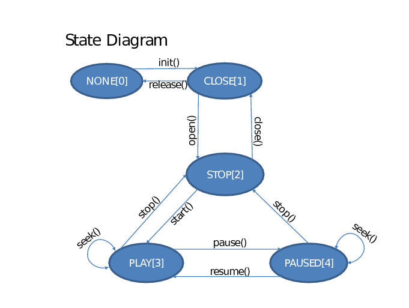


### Seek Sequence

1. Requests for NexPlayer™ to open, seek, pause, stop and resume are placed in a queue and handled in the
    order they are received.
2. When a queued operation completes, NexPlayer™ will notify the application by calling the **onAsyncCmdComplete** method in the listener.
3. Some of the requests can take significant time to complete (depending on various factors, for example, network conditions). Therefore, the recommended practice is for the application to issue only one request at a time and wait for that request to complete.
4. In order to provide the best user experience, after calling seek(), the application should wait for the associated `onAsyncCmdComplete` callback before calling `seek()` again. In the meantime, if the user continues to request seek operations (such as by dragging a seek bar in the user interface), the application should remember only the most recent seek request and issue that request after receiving `onAsyncCmdComplete`.

**Seek Function**

```java
if (mBoolSeekStarted)
{
	mSeekToTime = position;
}
else
{
	mBoolSeekStarted = true;
	iRet = mNexPlayer.seek(position);

	if(iRet != ERROR_NONE)
	{
		mBoolSeekStarted = false;
	}
}
```

**AsyncCmdComplete Function**
	
```java
case NexPlayer.NEXPLAYER_ASYNC_CMD_SEEK:
	if (mBoolSeekStarted)
	{
		iRet = mNexPlayer.seek(mSeekToTime);
		if(iRet != ERROR_NONE)
		{
			mSeekToTime = 0;
			mBoolSeekStarted = false;
		}
	else
	{
		mBoolSeekStarted = false;
	}
```
	
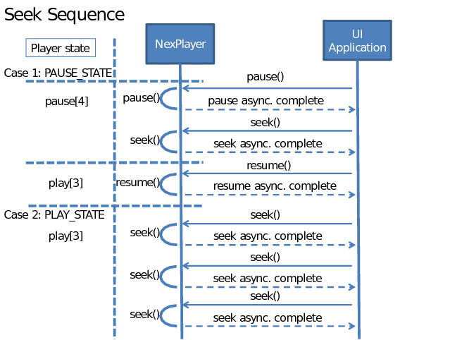

### Advice for Applications

It is recommended that *android:theme="@android:style/Theme.NoTitleBar"* be used in AndroidManifest.xml instead of *android:theme="@android:style/Theme.Wallpaper.NoTitleBar"*
since this setting may cause unwanted side effects in fonts when the OpenGL renderer is in use.

Developers are also encouraged to use all of the files and folders included in the SDK/libs folder with the NexPlayer™ SDK. If application size is an issue, please refer to **Selective Codec Support and Required Libraries**.


## Enabling Modified HTTP Requests

In order to modify an HTTP Request with NexPlayer™ :

1. Add the following code:

```java
mNexPlayer.setProperty(NexProperty.ENABLE_MODIFY_HTTP_REQUEST, 1);
```
	
After **init** but before calling **open** in order to set the property ENABLE\_MODIFY\_HTTP\_REQUEST to enabled.

2. The following override code must also be included for onModifyHttpRequest:

```java
@Override
public String onModifyHttpRequest(NexPlayer mp, int nRequestLength, Object in\_obj)
{
	String strData = "";
	try
	{
		Log.d(LOG\_TAG, "HTTP\_REQUEST : requestLength :"+nRequestLength+".");
		strData = (String)in\_obj;
		Log.d(LOG\_TAG, "HTTP\_REQUEST DATA :" + strData);
		Log.d(LOG\_TAG, "HTTP\_REQUEST DATA SET END!!! strData.length:"+strData.length()+".");
		return strData;
	}
	catch(Exception e)
	{
		e.printStackTrace();
	}
	return strData;
}
```
See **onModifyHttpRequest** for more information.

## Supported Subtitles, Timed Text, and Closed Captions

> **Warning** In content where both CEA 608/708 closed captions and WebVTT text tracks exist, NexPlayer™ will automatically display the WebVTT text cues but this can be changed by setting the NexProperty. ENABLE\_WEBVTT to 0 with setProperty.

The NexPlayer™ supports a variety of subtitle formats including:

1. Local subtitle files (.srt/.smi/.sub)
2. 3GPP and CFF (TTML) timed text
3. CEA 608 closed captions
4. CEA 708 closed captions
5. Web Video Text Tracks (WebVTT)

### Selective Support for Text Caption Formats

The NexPlayer™ SDK provides multiple different libraries related to text captions to support the different formats of captions possible in content.

The following libraries are related to text captions and are located in the *libs* folder in your project:

- libnexcal\_3gpp.so - include to support 3GPP timed text captions,
- libnexcal\_closedcaption.so - include to support CEA 608 and CEA 708 closed captions,
- libnexcal\_ttml.so - include to support TTML (CFF) timed text captions,
- libnexcal\_webvtt.so - include to support WebVTT text tracks

To reduce the size of an application apk, only include the libraries necessary for the caption format that will be supported in content. This means if content will only include WebVTT text tracks and not timed text or closed captions, the timed text (**libnexcal\_ttml.so** and **libnexcal\_3gpp.so**) and closed caption (**libnexcal\_closedcaption.so**) libraries can be safely deleted.

### Local Subtitles

For subtitles, the path of the subtitle file or the URL to load the subtitle file should be passed to the player in the *smiPath* parameter of **NexPlayer.open** when content is opened. When streaming content contains subtitles however, this *smiPath* should be set to *null* to avoid undefined behavior.

> **Warning** Only use NexPlayer.open to load local subtitles.

### Support for Other Caption Formats

Different subtitle formats also require different rendering, which is possible with the classes **NexCaptionRenderer**,
**NexCaptionRendererForTimedText**, **NexEIA708CaptionView**, and **NexCaptionRendererForWebVTT**

## Rendering Captions with NexCaptionPainter

The NexCaptionPainter™ renders a variety of subtitle formats including:

1. Local subtitle files (.srt/.smi/.sub)
2. Timed text markup language (TTML)
3. CEA 608 closed captions
4. CEA 708 closed captions
5. Web Video Text Tracks (WebVTT)

### To use NexCaptionPainter

NexCaptionPainter always needs to know the video output size in the application so that the subtitles can be correctly positioned. If a change into the video size is produced, that information should be notify to NexCaptionPainter.

**See Also**

- setRenderingArea

When a caption data is received on com.nexstreaming.nexplayerengine.NexPlayer#onTextRenderRender, it should
be passed to NexCaptionPainter by calling the **setDataSource** method.

When it is necessary to clear captions from the screen, for example when seeking or stopping content, the **clear** method will remove existing captions on the screen.

Lastly, **setUserCaptionSettings** will be helpful to make your own caption styles.

**See Also**

- NexCaptionPainter
- NexCaptionSetting
- NexCaptionWindowRect

When a caption renderer is in use, it always needs to know the video output size in the application so that subtitles can be correctly positioned. This means that when video changes size, that information should also be passed to the relevant caption renderer. Please see the relevant caption renderers for additional details on which methods to use to implement each kind of subtitles.

Lastly, note that in the case of CEA 608 closed captions, both **setOutputPos** and **setRenderArea** should be called when implementing the captions.

**See Also**

- com.nexstreaming.nexplayerengine.NexPlayer.open
- NexClosedCaption
- NexCaptionRenderer
- NexCaptionRendererForTimedText
- NexEIA708Struct
- NexEIA708CaptionView
- NexCaptionRendererForWebVTT

## Multi-Audio and Multi-Video Stream Playback

Certain streaming protocols provide multiple audio and video streams of the same content which are generally
intended to be selected by the user. NexPlayer™ provides the **setMediaStream()** API to allow these streams to be selected from the User Interface while content is being played.

The full list of available streams (if any) for particular content can be found in the **mArrStreamInformation** array in NexContentInformation.

**HTTP Live Streaming (HLS)**

HTTP Live Streaming supports multiple audio and video streams for particular content.

There are three possible use cases available:

1. **A variant playlist with alternative audio** :

	Audio and video are delivered in separate streams or groups of tracks. In this case, video and audio can be selected independently.
    For example, there could be two different audio tracks (different languages) for video stream A, which includes multiple tracks to be selected internally by the player by adaptive bitrate streaming.
    The audio tracks should be selected by the user while the player will display the appropriate video track based on network conditions and the device.

2. **A variant playlist with alternative video** :

    Each track contains both audio and video, but alternative video streams are available (for example different camera angles or views of the same content). In this case, the same audio is included in each track, and the user chooses which video stream to display. Tracks within a stream are selected internally based on network conditions and the device but the user can change video streams from the UI.

3. **A combination of a variant playlist with alternative video and audio** :

    This use case is a combination of cases 1 and 2, where a main video stream provides video tracks at different bitrates but INCLUDING the same audio, and separate audio tracks are available for optional language selection. To play the alternative audio tracks, the user selects them from the UI.

**See Also**

- setMediaStream()
- NexStreamInformation for more details about available content streams.

## Storing Streaming Content for Offline Playback

In some circumstances, media player users may want the option to download and store streaming content to be
played back when they are offline and cannot access a network. A developer can now offer users this feature with the NexPlayer™ SDK.

> **Warning** This feature is only currently supported for VoD content that is provided with the HLS and DASH protocols.

As of version 6.35, streaming content can be downloaded and stored as quickly as network condition allow without playing the content by calling *NexPlayer.open()* with the *type* parameter set to *NEXPLAYER\_SOURCE\_TYPE\_STORE\_STREAM*.

The offline storage progress can be monitored with the asynchronous command complete values *NEXPLAYER\_ASYNC\_CMD\_OPEN\_STORE\_STREAM* and *NEXPLAYER\_ASYNC\_CMD\_START\_STORE\_STREAM* as well as
with the status report message *NEXPLAYER\_STATUS\_REPORT\_DOWNLOAD\_PROGRESS*, which delivers the
percentage (0 to 100) of the content that has been successfully downloaded. Once the desired content has been successfully downloaded, it can be played at any time by calling *NexPlayer.open()* with the type parameter set to *NEXPLAYER\_SOURCE\_TYPE\_STREAMING* and the URL used to store the content.

> **Note** Please note that the same value used to call NexPlayer.setVideoBitrate when storing the streaming content must also be used when opening the stored content to play it offline.

This mode of using the NexPlayer™ engine only supports basic APIs such as *open()*, *start()*, *stop()*, and *close()*.

Content stored by the user with this feature can even be played back offline in different applications (not just the NexPlayer™-SDK-based app used to store the content).

#### 1.10.1 API Sequence to Store HLS or DASH Content
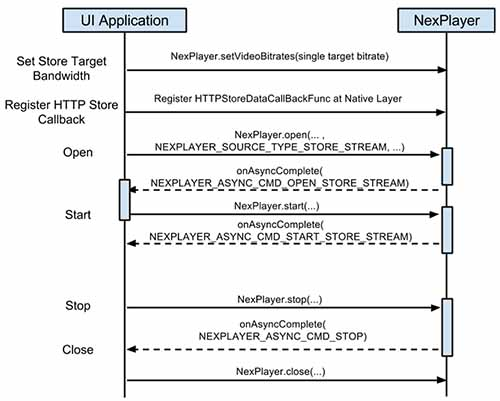

*Figure 1.1: Sequence diagram for storing HLS or DASH content*
 
#### 1.10.2 API Sequence to Play Stored HLS or DASH Content Offline
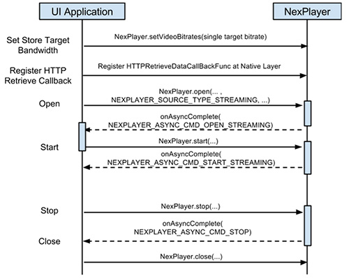
 
Figure 1.2: Sequence diagram for playing HLS or DASH content
 
*See Also*

- NEXPLAYER\_SOURCE\_TYPE\_STORE\_STREAM
- NexPlayer.open

## New Offline Playback

The new offline playback feature is an expansion, which is a better way of saving and managing the data required for offline playback storing than a database. For more details, refer to Section **Storing Streaming Content for Offline Playback**.

In the new offline playback, every storing step will create a file that contains stored info instead of a database. Using this file and calling this API once will enable *Continue Store and Retrieve*.

> **Note** The new offline playback does not support storing and playing content simultaneously. If you wish to do both actions, please use the previous offline playback method.

### How to Store HLS or DASH content

To store a desired track bandwidth or media stream, the user must set values using **setOfflineStoreSetting** before calling **startOfflineStore**. If not, the values will be set to default. When stored info file gets input information, **stopOfflineStore** method is called. Therefore, the user must call **stopOfflineStore** after **startOfflineStore**.

1. Create instances of NexPlayer and NexALFactory, and initialize them.
2. Create an instance of **NexOfflineStoreController**.
3. (Optional) Using **setOfflineStoreSetting**(...), set values.
4. Register IOfflineStoreListener using NexOfflineStoreController.setListener().
5. Call **startOfflineStore**(url, storeInfoFile, transportType) and start storing.
6. Call **stopOfflineStore()** to stop storing.

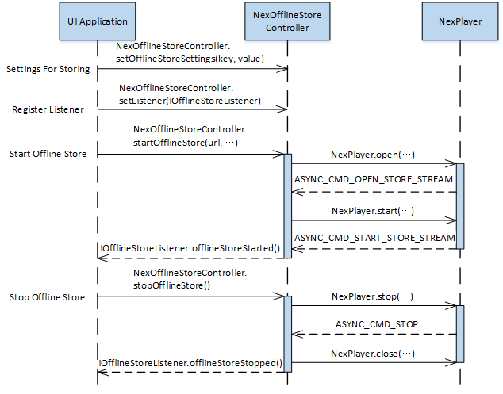
 
Figure 1.3: Sequence diagram for storing HLS or DASH content with NexOfflineStoreController
 
### How to Retrieve Offline Cache

To play stored content offline, there must be a stored info file. When this file is passed to the API **open** or **openFD** is called in the FileDescriptor format, the user can easily open media without any settings.

1. Create instances of NexPlayer and NexALFactory, and initialize them.
2. Call **open** () or **openFD** () to open media.
3. When the cmd NEXPLAYER\_ASYNC\_CMD\_OPEN\_STREAMING is passed to onAsyncCmdComplete(), call
    NexPlayer.start to begin playing content.
    
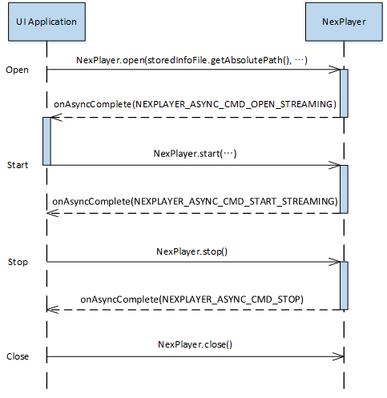

Figure 1.4: Sequence diagram for retrieving HLS or DASH content with NexOfflineStoreController
 
### How To Store Media DRM Content

1. Initialize NexPlayer and NexALFactory.
2. Create an instance of **NexOfflineStoreController**.
3. Set the Key server URL using **setOfflineStoreSetting** API.
4. Implement IOfflineKeyListener and then register it by using **setOfflineKeyListener** API.
5. Register IOfflineStoreListener using NexOfflineStoreController.setListener().
6. Call **startOfflineStore** ().
7. **NexOfflineStoreController** will get credentials from the Key Server, and then store content automatically.

To store media DRM content and then to retrieve, the user needs the same offline key ID from storing. Therefore,
the user must store the ID in the stored info file to retrieve and playback offline successfully.

To playback offline any stored media DRM content, pass the offline key ID to the instance of **NexOfflineStoreController** by using **setOfflineStoreSetting** API.

```java
@Override
public void onOfflineKeyStoreListener(NexPlayer mp, byte[] keyId) {
	if ( keyId != null ) {
		NexOfflineStoreController.setOfflineStoreSetting(
		NexPlayer.NexOfflineStoreSetting.STRING_OFFLINE_KEY_ID,
		Base64.encodeToString(keyId, Base64.DEFAULT));
	}
}
```

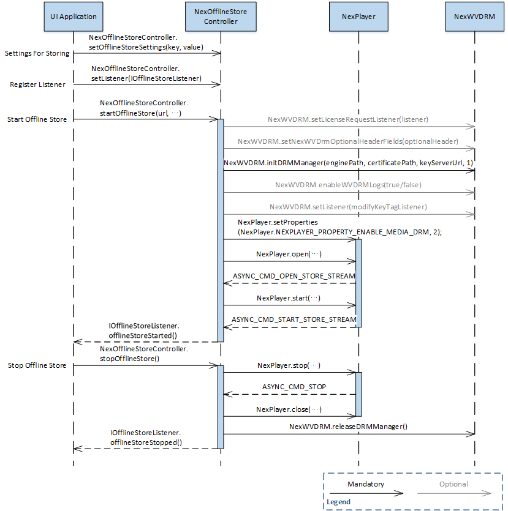

 
Figure 1.5: Sequence diagram for storing HLS or DASH Widevine content.
 
### How To Retrieve Media DRM Content

1. Initialize NexPlayer and NexALFactory.
2. Implement IOfflineKeyListener and then register it using **setOfflineKeyListener** API.
3. Call **open** () or **openFD** () to open media.
4. NexPlayer will get credentials from the Key Server, and then play content automatically.

The user must decode the saved string data in the stored info file as a byte and return it to **onOfflineKeyRetrieveListener**. Refer to Section Obtaining Saved Data from the Stored Info File.

```java
	@Override
	public byte[] onOfflineKeyRetrieveListener(NexPlayer mp) {
		byte[] keyId = null;
		if( mStoreInfoFile != null ) {
			JSONObject obj = NexOfflineStoreInfoUtils.parseJSONObject(mStoreInfoFile);
			try {
				String sKeyId = obj.getString(NexOfflineStoreInfoUtils.STORE_INFO_KEY_OFFLINE_KEY_ID);
				if(sKeyId != null)
					keyId = Base64.decode(sKeyId, Base64.DEFAULT);
			} catch (JSONException e) {
				e.printStackTrace();
			}
		}
		return keyId;
	}
```

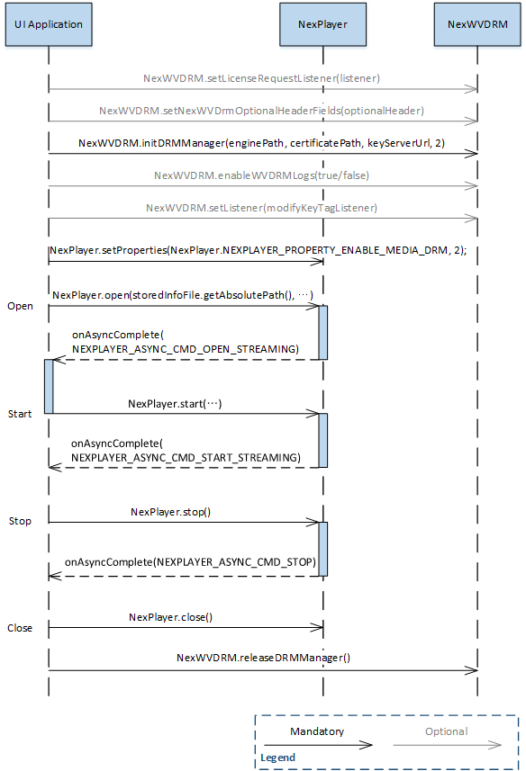
 
Figure 1.6: Sequence diagram for retrieving HLS or DASH Widevine content.
 
### Creating a Stored Info File List

In **startOfflineStore**, the user can create a custom name Stored Info File using parameter storedInfoFile.
In the application, define extensions that will be considered as stored info files, and create a custom name stored info file using parameter storedInfoFile. After doing so, search only files with that extension to create a stored info file list.

### Obtaining Saved Data from the Stored Info File

1. Using parseJSONObjectopen (...) API, get JSONObject.
2. In JSONObject.get∼ API, obtain desired data using the constants defined in **NexStoredInfoFileUtils**.

> **Note** Please match the data type and when using Get method of JSONObject. Refer to Section Obtaining Saved Data from the Stored Info File.*

**Example code**

```java
JSONObject storeInfo = NexStoredInfoFileUtils.parseJSONObject(storeInfoFile);
if( storeInfo != null ) {
	String info = "";
	try {
		info += "URL :\n" + storeInfo.getString(
		NexStoredInfoFileUtils.STORE_INFO_KEY_STORE_URL);
		
		info += "\n\nStore path :\n" + storeInfo.getString(
		NexStoredInfoFileUtils.STORE_INFO_KEY_STORE_PATH);
		
		info += "\n\nStore Percentage : " + storeInfo.getInt(
		NexStoredInfoFileUtils.STORE_INFO_KEY_STORE_PERCENTAGE);
		
		info += "\n\nBandwidth : " + storeInfo.getInt(
		NexStoredInfoFileUtils.STORE_INFO_KEY_BW);
	} catch (JSONException e) {
		e.printStackTrace();
	}
}
```

## Jelly Bean Support

Starting from the *Jelly Bean* version of the Android operating system (version 4.1), only the OpenGL video renderer is supported when the software decoder is in use. The other video renderers may not be used on devices running Jelly Bean if the software decoder must be used. The NexPlayer™ SDK is also adding support for the hardware (HW) decoder for devices running Jelly Bean and this means that in order to handle all cases, application source code should be able to handle switching between the OpenGL renderer (on devices where the HW decoder is not supported) and the hardware (HW) renderer.

Succinctly:

- When a device running Jelly Bean must use the software decoder, the OpenGL renderer must be used.
- When a device running Jelly Bean can use the hardware decoder, the hardware renderer must be used.

This means that an application must:

- first check the device render mode (to see if the hardware renderer is available) by calling the method **NexPlayer.GetRenderMode** and - then switch the rendering mode in the call to the **onVideoRenderPrepared** method based on that render mode.

Please also review the sample code for details.

## Honeycomb Support

Under theHoneycombversion of the Android operating system, only the OpenGL ES 2.0 or Java-based video renderers are currently supported. Both of these renderers require supporting code in the application. This means that in order to support Honeycomb, you must implement either OpenGL ES 2.0 or Java renderer support in your application. For other Android OS versions, this is not necessary, although on some devices there may be performance advantages from using the OpenGL ES 2.0 renderer. While either the OpenGL ES 2.0 renderer or the Java renderer will work on Honeycomb, it is recommended to use the OpenGL ES 2.0 renderer, as performance is generally better with that renderer, and implementation is easier.

See **OpenGL Renderer** and **Java Renderer** for details.

In addition, use caution with the following APIs on Honeycomb:

- **setOutputPos** is not supported with the Java renderer. For this same functionality, you may perform scaling yourself in theonVideoRenderRendercallback (see the **Java Renderer** explanation for details). You may call this from the OpenGL renderer.
- **setDisplay** is not supported on Honeycomb at all and must NOT be called. It is also not supported by the OpenGL renderer and must not be called if the OpenGL renderer is being used.

## Renderers

Depending on the Android OS version and device specifications, the NexPlayer™ offers support for different renderers to render and display video as summarized in the table below, where OpenGL, Android, and Java indicate the OpenGL, Java, and Android renderers.

- Android: NEX\_USE\_RENDER\_AND
- OpenGL: NEX\_USE\_RENDER\_OPENGL
- HW Renderer: NEX\_USE\_RENDER\_IOMX

As of version 6.1, the NexPlayer™ SDK also offers **NexVideoRenderer**, a video renderer that automatically
handles video rendering tasks for an application by choosing the most appropriate renderer based on the device and version of the operating system. Use of this renderer greatly simplifies the handling of video rendering tasks and is thus highly recommended.

**See Also**

*Please see NexPlayer.setVideoRendererListener and NexVideoRenderer for more information.*

> **Warning** In the event that an application will continue to handle video rendering tasks as in previous SDKs, please note that this is possible. The application must still however implement and set the new **IVideoRendererListener** that replaces the deprecated video renderer related methods in NexPlayer.IListener, but the previous listener
methods can be reused. To do this:

> 1. Declare that the class implementing NexPlayer.IListener also implements NexPlayer.IVideoRendererListener.

>2. Call **setVideoRendererListener** in addition to calling NexPlayer.setListener.

If the video surface is destroyed suddenly while NexPlayer is playing content, and it uses **NEX\_USE\_RENDER\_IOMX**, NexPlayer will call PAUSE or STOP immediately to prevent any collisions or crashes with the H/W Decoder.
Through this process, UI will receive onAsyncCmdComplete:NEXPLAYER\_ASYNC\_CMD\_PAUSE.

### OpenGL Renderer

This version of the NexPlayer™ engine supports OpenGL ES 2.0 rendering. This renderer may be used on devices
running Froyo and later and is the default renderer for Honeycomb and Ice Cream Sandwich (ICS). This is also the **ONLY** renderer supported for Jelly Bean when the software codec must be used by a device. However *there are certain Froyo devices that do NOT support the OpenGL Renderer*. In these cases, it is necessary to check which renderer is in use when **NexPlayer.open** is called by also calling **GetRenderMode**.

If this is not implemented by the application, another renderer must be specifically requested when calling NexPlayer™’s **init** method.

> **Warning** When testing an application, please note that the OpenGL renderer does not work in the Android emulator provided with the Android SDK. If an application is to be tested in the emulator, it will be necessary to use one of the other renderers available. Testing content using the OpenGL renderer must happen on an actual device, not through the emulator.*

> **Note** While the Android renderer may be the default renderer for Gingerbread, there are instances where another renderer may provide better performance on certain devices. In particular, while the Kindle Fire runs on Gingerbread, the OpenGL renderer is recommended because it provides better performance. See init for
more details.

To use the OpenGL renderer, the application must create an instance of the GLRenderer class (supplied as part of the NexPlayer™ SDK). GLRenderer is a GLSurfaceView subclass, and the video frame will be displayed within it.

By default, the frame is stretched to fill the entire surface. The rectangle in which the video is drawn can be changed by calling **setOutputPos**. This rectangle is in screen pixels (not in the OpenGL coordinate space) but the position is relative to the GLRenderer.

In addition, an application must also do the following, in order to support the OpenGL renderer:

1. Call NexPlayer™’s **init** method, passing the model name of the current device (you can attempt to force the use of the OpenGL renderer for debugging purposes by passingNEX\_DEVICE\_USE\_OPENGLinstead of the device name).

2. After initializing NexPlayer™, In **onVideoRenderPrepared**, check which renderer is being used to determine if it is the OpenGL renderer. Any special code to support the OpenGL renderer should be conditional based on the renderer in use. To determine the current renderer in use, call **GetRenderMode** and check the result, as follows:

```java
if(mNexPlayer.GetRenderMode() == NexPlayer.NEX_USE_RENDER_OPENGL) {
	UseOpenGL = true;
}
```

3. Create an instance of the GLRenderer class and add it to the main view for the activity or some other visible view in your layout:

```java    
if(UseOpenGL) {
	mContext = this;
	mGLListener = this;
	glRenderer = new GLRenderer(mContext, mNexPlayer, mGLListener, colorDepth);
	FrameLayout v = (FrameLayout)findViewById(R.id.gl_container);
	v.addView(glRenderer);
}
```

> **Note** Once the GLRenderer has been created, the onSurfaceCreated and onSurfaceChanged methods of GLSurfaceView.Renderer will be automatically called.onSurfaceChanged is also called when the size of the surface has changed (for example, due to a device orientation change).

4. In the implementation of *GLSurfaceView.Renderer.onSurfaceChanged*, **NexPlayer.GLInit** must be called to inform NexPlayer™ of the new size of the surface:

	```java
	public void onSurfaceChanged(GL10 gl, int width, int height) {
		mNexPlayer.GLInit(width, height);
	}
	```		

5. In **onVideoRenderCreate**, the dimensions of the video frame are known, so scaling calculations can be performed and the correct output size can be set:

	```java
	if(nRenderMode != NexPlayer.NEX_USE_RENDER_JAVA) {
		int left = (mSurfaceWidth - mVideoWidth) / 2;
		int top = (mSurfaceHeight - mVideoHeight) / 2;
		mNexPlayer.setOutputPos( left, top, mVideoWidth, mVideoHeight );
	}
	```

6. When NexPlayer™ is ready to display a new frame, it calls **onVideoRenderRender**. For most rendering modes, there is nothing to be done in reponse, but for OpenGL, it is necessary to request a rendering pass from the GLRenderer as follows:
    
	```java
		if(UseOpenGL) {
			glRenderer.requestRender();
		}
	```	

This causes the GLRenderer to render its contents.

> **Note** Whenever the size of the surface changes, for example due to an orientation change, the GLRenderer must also pass the new dimensions to the application through the IListener interface by: `void onGLChangeSurfaceSize( int width, int height);`

### Java Renderer

This version of the NexPlayer™ engine supports Java-based rendering in addition to the usual video rendering
methods. However, the Java renderer is never automatically selected; if you wish to use the Java-based renderer, you must explicitly request it when calling NexPlayer™’s *init* method. Please note though that from the Jelly Bean operating system, the Java renderer is **not** supported.

With Java-based rendering, NexPlayer™ doesn’t display the video after it is decoded, but rather passes each frame to the application, which then must display the frames as they are received.

Java-based rendering tends to be slower, particularly on low-end devices, but allows the application to perform post-processing or custom scaling operations on each frame.

On the *Honeycomb* operating system, only Java-based rendering or OpenGL renderer is supported. Therefore, in order to support Honeycomb, your application must implement one of the two.

If for some reason, you wish to force the use of the Java renderer, you can do so by passing **NEX\_DEVICE\_USE\_JAVA** to NexPlayer™’s **init** method.

To support the Java renderer, the application must do the following:

- In **onVideoRenderCreate**, the application must create a bitmap that NexPlayer™ can render frames into.
NexPlayer™ can render in either RGBA8888 or RGB565. The color depth is specified in the call to NexPlayer™’s **init** method. The bitmap you create here must match that color depth. Once the bitmap has been created, it must be registered with the player engine by calling **SetBitmap**. Here’s the recommended way to support the Java renderer in `onVideoRenderCreate`:

```java
private ByteBuffer mRGBBuffer = null;
private Bitmap mFrameBitmap = null;

public void onVideoRenderCreate(NexPlayer mp, int width, int height, Object rgbBuffer)
{
	// ...other necessary onVideoRenderCreate code goes here...

	if(mNexPlayer.GetRenderMode() == NexPlayer.NEX_USE_RENDER_JAVA)
	{
		if(this.mScreenPixelFormat == PixelFormat.RGBA_8888)
		{
			mFrameBitmap = Bitmap.createBitmap(width, height, Config.ARGB_8888);
		}
		else
		{
			mFrameBitmap = Bitmap.createBitmap(width, height, Config.RGB_565);
		}
		mNexPlayer.SetBitmap( mFrameBitmap );
	}
}
```
- The application must implement **onVideoRenderRender**. The bitmap registered in `onVideoRenderCreate` will have been filled in with the rendered frame before this method was called. The application must draw that bitmap to the screen, taking into account scaling and other factors. This can be done using standard Android API calls and standard Java methods. Scaling should be taken into account. See the sample application that accompanies the SDK for an example implementation of this method.

**Determining the Renderer:** To determine the current renderer in use, call **GetRenderMode**. For example, to determine if the Java renderer is in use:

```java
if(mNexPlayer.GetRenderMode() == NexPlayer.NEX_USE_RENDER_JAVA) {
	// code for Java renderer only
}
```

## Support for Time Shift in Live Content

This version of the NexPlayer™ SDK introduces support for timeshifting playback in HLS Live content. While content may be viewed live, a certain amount of time in the past or future may also be available to be played, depending on the server for the given content. NexPlayer™ uses the method `getSeekableRangeInfo` to determine the range within content where `seek` can be performed and thus within which playback may be timeshifted.

Please also see **getSeekableRangeInfo()** for more information.

## Setting AV Synchronization

When using NexPlayer™ to playback audio-video content, audio-video synchronization is optimized internally but there may still be some devices that display video slightly out of sync with the audio. To support devices like these, the audio-video synchronization may be set manually using the NexProperty **AV\_SYNC\_OFFSET** and the best value to set this property for a particular device must be determined by guessing and testing.

The code of the included sample application illustrates how this property can be set to different values for specific devices.

Currently, devices with known AV-sync issues include the Galaxy Nexus, the Kindle Fire, and the Galaxy Note
although synchronization challenges may also occur on other devices.

For example, to improve synchronization on the Galaxy Nexus, set AV\_SYNC\_OFFSET to the value XXX as follows:

```java
if(android.os.Build.MODEL.equalsIgnoreCase("Galaxy Nexus")) {
	mDevAVSyncOffset = XXX;
}
	
Log.d(TAG, "Device Model Name : " + android.os.Build.MODEL + " Dev Offset Time : " + mDevAVSyncOffset);

mNexPlayer.setProperty(NexProperty.AV_SYNC_OFFSET, mDevAVSyncOffset);
```

Appropriate values for any devices displaying AV-sync issues can be determined by trial and error with different values, but most devices’ AV synchronization should generally be handled by NexPlayer™ internally.

## Buffer Support

NexPlayer™ loads content data into buffers in a device’s memory to prepare for playback (the so-called Prefetch
buffer in NexPlayer™). Buffer settings can be adjusted in multiple ways with the properties listed below:

- **To Control Buffer Size** :
 - `PREFETCH_BUFFER_SIZE`: This property sets the size of the prefetch buffer to prepare for playback.
 The default value is 50MB but depending on the content size, this value can be adjusted accordingly. If the buffer status satisfies either limit set by MAX\_BUFFER\_RATE or MAX\_BUFFER\_DURATION, the filling of the prefetch buffer will be stopped even though there may be spare space still available in the prefetch buffer.

- **To Control Buffering Duration** : NexPlayer™ uses two separate properties to determine buffering time, `INITIAL_BUFFERING_DURATION` and `RE_BUFFERING_DURATION`.

 - `INITIAL_BUFFERING_DURATION`: This property defines the initial time to buffer before beginning streaming playback (HLS, RTSP, etc). The default value is 5 seconds and when the buffer status meets this value set by `INITIAL_BUFFERING_DURATION`, the player will pause the filling of the buffer. This value is generally lower so that playback can begin as quickly as possible.
 - `RE_BUFFERING_DURATION`: This property defines how much content should be buffered when additional buffering during streaming playback (HLS, RTSP, etc) is necessary. The default value is 5 seconds and when the buffer status meets this value set by RE\_BUFFERING\_DURATION, the buffering will be paused. This re-buffering duration is also used when seeking in content (if the target seek destination time falls outside of the previously buffered content data).

### How Buffering Operates in General

NexPlayer™ will start filling the prefetch buffer automatically when the amount of data loaded in memory becomes
less than the value set by a property defining the buffering minimum. Similarly, the buffer will stop loading data
segments when the memory is filled more than the value set by a property defining a maximum buffered amount.
The actual properties defining this behavior operate differently depending on the protocol type of the content, but
these operations will run automatically in the background and can be adjusted with the following properties:

- **For Non-HTTP Protocols** :

 - `MIN_BUFFER_RATE`: If the prefetch buffer is less full than the value set by this property, the buffer will resume filling until the buffer status meets one of the conditions set by either *MAX\_BUFFER\_RATE* or *MAX\_BUFFER\_DURATION*. The default value is 30%.
 - `MAX_BUFFER_RATE`: If the prefetch buffer is more than this value percent full, buffering will be paused
       until the buffer status meets the condition set by the property MIN\_BUFFER\_RATE. The default value
       is 90%.
 - `MIN_BUFFER_DURATION`: If the duration of content available in the filling buffer is less than this value,
       buffering will resume filling the buffer until its status meets one of the conditions set by either MAX\_BUFFER\_RATE or MAX\_BUFFER\_DURATION. The default value is 30 seconds.
 - `MAX_BUFFER_DURATION`: If the duration of content available in the filling prefetch buffer is greater
       than this value, buffering will be paused until the buffer status meets the condition of MIN\_BUFFER\_DURATION again. The default value is 300 seconds.

- **For HTTP Protocols** : For HTTP protocols, only properties defining buffering maximums, MAX\_BUFFER\_DURATION and MAX\_BUFFER\_RATE, are available. The properties work in the same way as for non-HTTP protocols. After being paused automatically, buffering will automatically resume after 10% of the buffer is exhausted. Note that when MAX\_BUFFER\_DURATION and MAX\_BUFFER\_RATE are both set, NexPlayer™ will apply the first maximum value that is met. For example, if the percentage set by MAX\_BUFFER\_RATE is passed first, the prefetch buffering will automatically pause even if the buffer is less full than the duration value set for MAX\_BUFFER\_DURATION.

## Client Time Shift

Time shifting is a feature to store real-time data as it is received so that the user can watch past data while playing
live content. The user can seek freely within the stored buffer. When the user seeks to a certain time, the a/v data
before the seek time will be deleted gradually.

- **How to activate and execute Client Time Shift** :

To activate Client Time Shift, set the properties below. Then the player will continue to download the file even if it is paused. If the player fills the buffer with uiTimeShiftDuration minutes, or if the buffer is full, then the playback will resume automatically. To go to live position, call *gotoCurrentLivePosition* API.
 
 - Example 1: Activate Client Time Shift

	```java
	boolean bEnable = true;
	String strFileBufferPath = null; // Stored path
	int uiTimeShiftBufferSize = 400; // Maximum buffer size (Mega Bytes)
	int uiTimeShiftDuration = 10; // Maximum buffer duration (Minutes)
	mNexPlayer.setClientTimeShift(bEnable, strFileBufferPath, uiTimeShiftBufferSize, uiTimeShiftDuration);
	```	

 - Example 2: Execute Client Time Shift by pausing the player (The download will continue)
   
	```java
	mNexPlayer.pause();
	``` 

 - Example 3: Go to live position
       
	```java
	mNexPlayer.gotoCurrentLivePosition();
	```

- **Detailed description of how Client Time Shift works.** :
 - Backward buffer and forward buffer
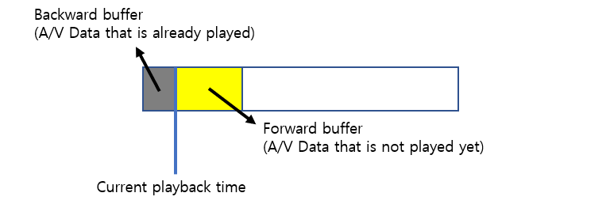
 
Figure 1.7: Backward buffer and forward buffer
 
- Timeshift Duration includes the backward buffer as well.
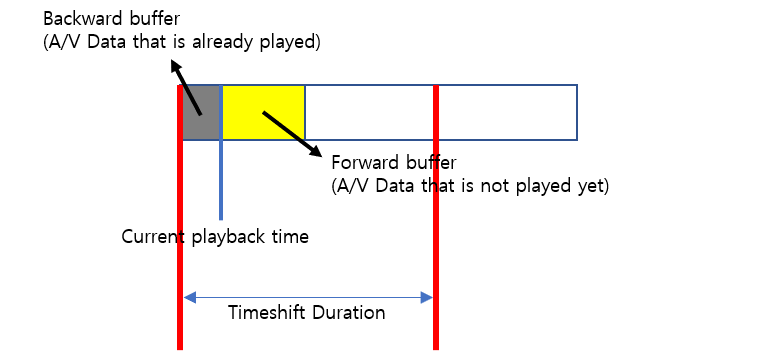
 
Figure 1.8: Timeshift Duration includes the backward buffer
 
- When *pause*() is called, the player fills the buffer until it has filled in the buffer for a Timeshift Duration. When the buffer is filled with Timeshift Duration, the player resumes playback. If the user tries to pause immediately after playback is resumed, the player will immediately restart because it has a buffer filled in Timeshift Duration.

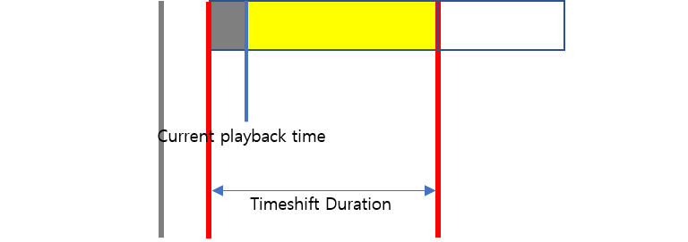
 
Figure 1.9: Fill the buffer until it reaches to the Timeshift Duration
 
- As the playback time elapses, the buffer behind the playback time is deleted and new data is buffered. Therefore, the total amount of the buffered data is approximately equal to the Timeshift Duration. If the user tries to pause at this point, the player may immediately resume because the buffer is already filled with TimeshiftDuration.

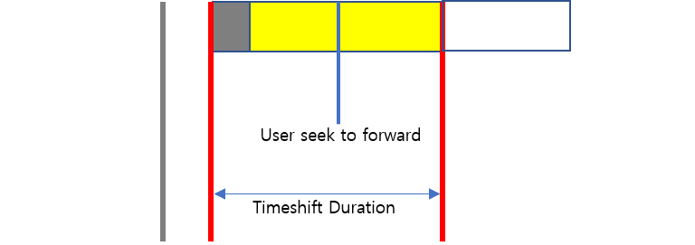
 
Figure 1.10: Go to play time
 
- If the user seeks forward, the buffer after the play time is deleted except the backward duration.
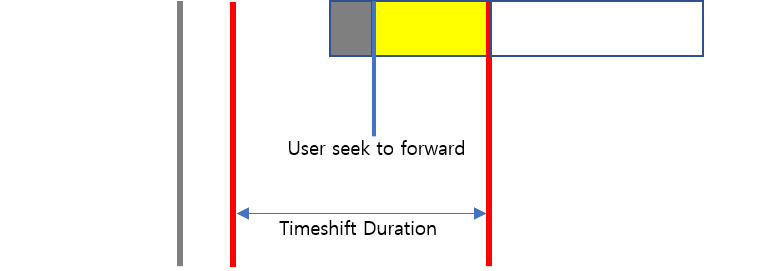
 
Figure 1.11: Seek to forward
 
- Then, the user can pause again. If pause is called, the player will fill the buffer up to Timeshift Duration.
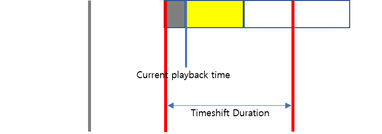
 
Figure 1.12: Pause again
 
## Low Latency

Low latency technology can make the user view the live content as close to real-time as possible.

**How to enable low latency mode**

Example : Activate Low Latency

```java
mNexPlayer.setProperty(NexPlayer.NexProperty.LIVE_VIEW_OPTION, NexPlayer.NexProperty.LIVE_VIEW_LOW_LATENCY);
mNexPlayer.setProperty(NexPlayer.NexProperty.PARTIAL_PREFETCH, 1);
```		       

**How to adjust the latency**

- **Buffer Option 1** : Manual Mode The latency value is set by INITIAL\_BUFFERING\_DURATION and RE\_BUFFERING\_DURATION of NexProperty. It should set the reliable value depending on the bitrate of content and network environment.
	Example :
	
	```java          
	mNexPlayer.setProperty(NexPlayer.NexProperty.LOW_LATENCY_BUFFER_OPTION, NexPlayer.NexProperty.
	LOW_LATENCY_BUFFEROPTION_NONE);
	```

	- Case 1 : For Ultra Low Latency This mode would be suitable for a managed network maintaining constant bandwidth(ex. Video services based on broadband). The latency might be around
1000ms. Example :

	```java    
	mNexPlayer.setProperty(NexPlayer.NexProperty.INITIAL_BUFFERING_DURATION, 500);
	mNexPlayer.setProperty(NexPlayer.NexProperty.RE_BUFFERING_DURATION, 500);
	```  
	
	> **Note** Buffering may occur frequently when bandwidth (Throughput) is not sufficient to deliver a
	segment or chunk in time.
	                  
         		
	- Case 2 : For Low Latency This mode would be suitable for public networks such as WiFi and LTE. The latency might be around 3000ms. Example :

	```java                
	mNexPlayer.setProperty(NexPlayer.NexProperty.INITIAL_BUFFERING_DURATION, 2000);
	mNexPlayer.setProperty(NexPlayer.NexProperty.RE_BUFFERING_DURATION, 2000);
	```    
         
	 
	> **Note** Buffering will rarely occur, but the latency will be slightly longer than the initial buffering time you set up.
             
       
	- Case 3 : Adjust latency for HLS. In case of HLS, the player has disadvantage in low latency perspective than DASH:
		- The player should reload the playlist in order to figure out the URL for the next segment.
		- According to the HLS spec., the player MUST wait at least the duration of the last segment in the Playlist before attempting to reload the Playlist file again.
		- HLS does not have the availabilityStartTime of the segment that is defined in DASH. Therefore, the player does not know when the next segment becomes available. For this reason, we would recommend setting the buffering time to a little bit longer value than the target duration. If target duration is 2 seconds, then we recommend setting the buffering time as below. Example :
	
	```java
	mNexPlayer.setProperty(NexPlayer.NexProperty.INITIAL_BUFFERING_DURATION, 4000);
	mNexPlayer.setProperty(NexPlayer.NexProperty.RE_BUFFERING_DURATION, 4000);
	```

Otherwise, buffering may occur frequently.

- **Buffer Option 2** : Auto Buffer Mode The latency value is calculated by the player at runtime. During playback, the latency may increase or decrease because it may change depending on the network environment. Example :

	```java
	mNexPlayer.setProperty(NexPlayer.NexProperty.LOW_LATENCY_BUFFER_OPTION, NexPlayer.NexProperty. LOW_LATENCY_BUFFEROPTION_AUTO_BUFFER);
	```

- **Buffer Option 3** : Constant Buffer Mode The latency value is calculated by the player at the beginning of playback and maintains the value unchanged during playback. The latency increases more than when using Auto Buffer Mode, but the rebuffering will be reduced and try to maintain constant latency after rebuffering. Example :

	```java
	mNexPlayer.setProperty(NexPlayer.NexProperty.LOW_LATENCY_BUFFER_OPTION, NexPlayer.NexProperty. LOW_LATENCY_BUFFEROPTION_CONST_BUFFER);
	```

## Video Synchronization

Video Synchronization technology be able to make the user view the same screen of live streaming content on
multiple devices simultaneously.

**How to enable video synchronization mode** :

- **Case 1** : To use Video synchronization in the sdk, please set the following properties.

	```java   
	mNexPlayer.setProperty(NexPlayer.NexProperty.ENABLE_SPD_SYNC_TO_GLOBAL_TIME, 1);
	mNexPlayer.setProperty(NexPlayer.NexProperty.PARTIAL_PREFETCH, 1);
	mNexPlayer.setProperty(NexPlayer.NexProperty.LIVE_VIEW_OPTION, 3);
	```
			       
- **Case 2**: To sync end users by DASH-SPD.
   	- If the MPD has suggestedPresentationDelay, then the player will render A/V frame with `suggestedPresentationDelay` latency. So end users will see the same video that is `suggestedPresentationDelay` seconds behind the live.

- **Case 3** : To sync end users by HLS-PDT.
   - Since HLS does not have SPD, the presentation delay to PDT time should be set manually.
   - Please set the presentation delay as below:

	```java
	mNexPlayer.setProperty(NexPlayer.NexProperty.SET_APPLS_PROGRAM_DATE_TIME_PRESENTATION_DELAY, DelayValueInMsec);
	```

 Then the player will work the same as DASH-SPD case such as suggestedPresentationDelay which is set to DelayValueInMsec. The end users are able to be both controlled the latency and synchronized by using this property in HLS.
		
- **Case 4** : Additional detailed methods:
	
	- If the current playback is not more synchronized compared to this value, the player will speed up playback and make sync.

		```java
		mNexPlayer.setProperty(NexPlayer.NexProperty.SET_SPD_SYNC_DIFF_TIME, MaxDiffValueMsec);
		```
	
	- If playback is out of sync compared to this value, the player will jump to synchronize the video rather than make it by speeding up. 

		```java
		mNexPlayer.setProperty(NexPlayer.NexProperty.SET_SPD_TOO_MUCH_DIFF_TIME, TooMuchSyncDiffValueMsec);
		```				
