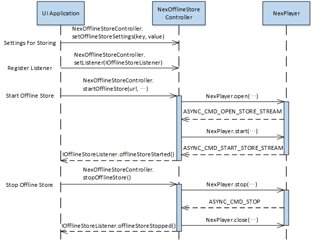
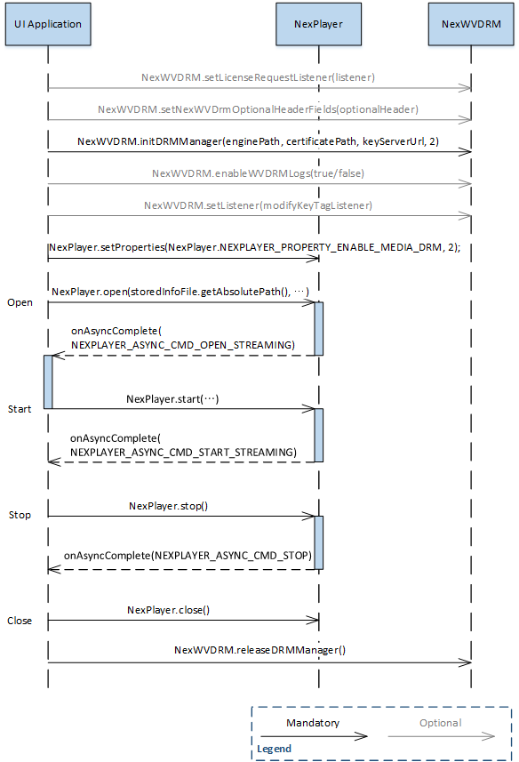

# Offline Playback

NexPlayer provides the feature of downloading content and reproduce it offline by using different and specific APIs for those operations.

In the offline playback, each store operation will create a file that contains stored info instead of a database. Using this file and calling this API once will enable *Continue Store and Retrieve*.

### How to Store HLS or DASH content

To store a desired track bandwidth or media stream, the user must set values using **setOfflineStoreSetting** before calling **startOfflineStore**. If not, the values will be set to default. Therefore, the user must call **stopOfflineStore** after **startOfflineStore**.

1. Create instances of NexPlayer and NexALFactory, and initialize them.
2. Create an instance of **NexOfflineStoreController**.
3. (Optional) Using **setOfflineStoreSetting**(...), set values.
4. Register IOfflineStoreListener using NexOfflineStoreController.setListener().
5. Call **startOfflineStore**(url, storeInfoFile, transportType) and start storing.
6. Call **stopOfflineStore()** to stop storing.


 
Figure 1.3: Sequence diagram for storing HLS or DASH content with NexOfflineStoreController
 
### How to Retrieve Offline Cache

To play stored content offline, there must be a stored info file. When this file is passed to the API **open** or **openFD** is called in the FileDescriptor format, the user can easily open media without any settings.

1. Create instances of NexPlayer and NexALFactory, and initialize them.
2. Call **open** () or **openFD** () to open media.
3. When the cmd NEXPLAYER\_ASYNC\_CMD\_OPEN\_STREAMING is passed to onAsyncCmdComplete(), call NexPlayer.start to begin playing content.
    


Figure 1.4: Sequence diagram for retrieving HLS or DASH content with NexOfflineStoreController
 
### How To Store Media DRM Content

1. Initialize NexPlayer and NexALFactory.
2. Create an instance of **NexOfflineStoreController**.
3. Set the Key server URL using **setOfflineStoreSetting** API.
4. Implement IOfflineKeyListener and then register it by using **setOfflineKeyListener** API.
5. Register IOfflineStoreListener using NexOfflineStoreController.setListener().
6. Call **startOfflineStore** ().
7. **NexOfflineStoreController** will get credentials from the Key Server and then store content automatically.

To store media DRM content and then to retrieve, the user needs the same offline key ID from storing. Therefore,
the user must store the ID in the stored info file to retrieve and playback offline successfully.

To playback offline any stored media DRM content, pass the offline key ID to the instance of **NexOfflineStoreController** by using **setOfflineStoreSetting** API.

```java
@Override
public void onOfflineKeyStoreListener(NexPlayer mp, byte[] keyId) {
	if ( keyId != null ) {
		NexOfflineStoreController.setOfflineStoreSetting(
		NexPlayer.NexOfflineStoreSetting.STRING_OFFLINE_KEY_ID,
		Base64.encodeToString(keyId, Base64.DEFAULT));
	}
}
```


Figure 1.5: Sequence diagram for storing HLS or DASH Widevine content.
 
### How To Retrieve Media DRM Content

1. Initialize NexPlayer and NexALFactory.
2. Implement IOfflineKeyListener and then register it using **setOfflineKeyListener** API.
3. Call **open** () or **openFD** () to open media.
4. NexPlayer will get credentials from the Key Server, and then play content automatically.

The user must decode the saved string data in the stored info file as a byte and return it to **onOfflineKeyRetrieveListener**. Refer to Section Obtaining Saved Data from the Stored Info File.

```java
	@Override
	public byte[] onOfflineKeyRetrieveListener(NexPlayer mp) {
		byte[] keyId = null;
		if( mStoreInfoFile != null ) {
			JSONObject obj = NexOfflineStoreInfoUtils.parseJSONObject(mStoreInfoFile);
			try {
				String sKeyId = obj.getString(NexOfflineStoreInfoUtils.STORE_INFO_KEY_OFFLINE_KEY_ID);
				if(sKeyId != null)
					keyId = Base64.decode(sKeyId, Base64.DEFAULT);
			} catch (JSONException e) {
				e.printStackTrace();
			}
		}
		return keyId;
	}
```


 
Figure 1.6: Sequence diagram for retrieving HLS or DASH Widevine content.
 
### Creating a Stored Info File List

In **startOfflineStore**, the user can create a custom name Stored Info File using parameter storedInfoFile. In the application, define extensions that will be considered as stored info files, and create a custom name stored info file using parameter storedInfoFile. After doing so, search only files with that extension to create a stored info file list.

### Obtaining Saved Data from the Stored Info File

1. Using parseJSONObjectopen (...) API, get JSONObject.
2. In JSONObject.get∼ API, obtain desired data using the constants defined in **NexStoredInfoFileUtils**.

> **Note** Please match the data type and when using Get method of JSONObject. Refer to Section Obtaining Saved Data from the Stored Info File.*

**Example code**

```java
JSONObject storeInfo = NexStoredInfoFileUtils.parseJSONObject(storeInfoFile);
if( storeInfo != null ) {
	String info = "";
	try {
		info += "URL :\n" + storeInfo.getString(
		NexStoredInfoFileUtils.STORE_INFO_KEY_STORE_URL);
		
		info += "\n\nStore path :\n" + storeInfo.getString(
		NexStoredInfoFileUtils.STORE_INFO_KEY_STORE_PATH);
		
		info += "\n\nStore Percentage : " + storeInfo.getInt(
		NexStoredInfoFileUtils.STORE_INFO_KEY_STORE_PERCENTAGE);
		
		info += "\n\nBandwidth : " + storeInfo.getInt(
		NexStoredInfoFileUtils.STORE_INFO_KEY_BW);
	} catch (JSONException e) {
		e.printStackTrace();
	}
}
```
## Properties

### DOWNLOADER_HTTP\_HEADER (0x00090002)

This property adds additional header fields to be sent along with the HTTP headers when sending streaming requests (HLS and Smooth Streaming) from the Downloader module.

This property should be set before the Downloader module is opened by DownloaderOpen().

- **Type:** String

### DOWNLOADER_USERAGENT\_STRING (0x00090001)

An RTSP/HTTP User Agent value associated with the Downloader module.

This property should be set before the Downloader module is opened.

- **Type:** String

## Classes

### IOfflineStoreListener Interface

This interface allows the application to get events about the Offline Store from `NexOfflineStoreController`.

When storing data to `NexOfflineStoreController`, the user must call `setListener(IOfflineStoreListener i)` to get events before startOfflineStore. When the user wants to call an API that edits UI-related APIs or the state of OfflineStore such as `stopOfflineStore()` from `IOfflineStoreListener` callback, they must use a Handler in order for the API to be
able to run on the main application thread.

#### void onDownloadEnd (boolean completed)

This event is called when the download is complete.

**Parameters**
 
| Name      | Description                                                                                                               |
|-----------|-------------------|
| completed | Set to *TRUE* for when the content is completely downloaded. Call stopOfflineStore after onDownloadEnd(true) is received. |

#### void onDownloading (int percentage)

This event reports the progress of download.

**Parameters**

| Name      | Description                                                                                                               |
|-----------|-------------------|
| percentage | Percentage of the content downloaded |

#### void onError (NexPlayer.NexErrorCode errorCode)

This event is called when there is an error.

**Parameters**

| Name      | Description                                                                                                               |
|-----------|-------------------|
| errorCode | The error code for the generated error. |

### NexOfflineStoreController Class

The new offline playback feature is an expansion, which is a better way of saving and managing the data required for offline playback storing than a database.

#### static int deleteOfflineCache (File storedInfoFile)

This method deletes the cache directory files and then the stored info files.

**Parameters**

| Name  | Description  | 
|---|---|
| storedInfoFile | The file descriptor of the info file created from storing.|  

**Returns**
 
Zero for success, or a non-zero NexPlayer error code in the event of a failure.
 
#### int deleteOfflineCache (String storedInfoFilePath) [static]

This method deletes the cache directory files and then the stored info files.

**Parameters**

| Name  | Description  | 
|---|---|
| storedInfoFilePath | The absolute path of the stored info file.|   

**Returns**
 
Zero for success, or a non-zero NexPlayer error code in the event of a failure.
 
#### int pauseOfflineStore ()

This method pauses storing.

If `IOfflineStoreListener` is already registered, `offlineStorePaused` callback is called when the Offline Store is paused.

**Returns**
 
Zero for success, or a non-zero NexPlayer error code in the event of a failure.
 
#### int resumeOfflineStore ()

This method resumes storing from where it paused.

If IOfflineStoreListener is already registered, offlineStoreResumed callback is called when the Offline Store is resumed.

**Returns**
 
Zero for success, or a non-zero NexPlayer error code in the event of a failure.
 
#### void setListener (IOfflineStoreListener l)

The user must register IOfflineStoreListener in NexOfflineStoreController in order for the application to get Offline Store events.

The application must call setListener before calling startOfflineStore.

**Parameters**

| Name  | Description  | 
|---|---|
| l | The callback to be invoked.|   

#### void setOfflineStoreSetting (NexOfflineStoreSetting setting, int value)

This method sets the setting values needed for storing.

Settings that are not customized will be set to default values. The user must call this method before calling startOfflineStore(), but settings will be ignored for Continue Store and Retrieve.

**Parameters**

| Name  | Description  | 
|---|---|
| setting | The NexOfflineStoreSetting to set.|   
| value | The new integer value for the NexOfflineStoreSetting.|    

#### void setOfflineStoreSetting (NexOfflineStoreSetting setting, String value)

This method sets the setting values needed for storing.

Settings that are not customized will be set to default values. The user must call this method before calling startOfflineStore(), but settings will be ignored for Continue Store and Retrieve.

**Parameters**

| Name  | Description  | 
|---|---|
| setting | The NexOfflineStoreSetting to set.|   
| value | The new String value for the NexOfflineStoreSetting.|    

#### int startOfflineStore (String url, String storedInfoFilePath, int transportType)

This method starts Offline storing.

If `IOfflineStoreListener` is already registered, offlineStoreStarted callback is called when the Offline Store is started.

**Parameters**

| Name  | Description  | 
|---|---|
| url | The URL to store |   
| storedInfoFilePath | The absolute path of the stored info file |   
| transportType | NEXPLAYER_TRANSPORT_TYPE_TCP <br/> NEXPLAYER_TRANSPORT_TYPE_UDP|   

**Returns**

Zero for success, or a non-zero NexPlayer error code in the event of a failure.
 
#### int startOfflineStore (String url, String storedInfoFilePath, int transportType, Map <String, String> optionalHeaders)

This method starts Offline storing.

If IOfflineStoreListener is already registered, offlineStoreStarted callback is called when the Offline Store is started.

**Parameters**

| Name  | Description  | 
|---|---|
| url | The URL to store |   
| storedInfoFilePath | The absolute path of the stored info file |   
| transportType | NEXPLAYER_TRANSPORT_TYPE_TCP <br/> NEXPLAYER_TRANSPORT_TYPE_UDP|   
| optionalHeaders | Optional Headers for the license request|   

**Returns**
 
Zero for success, or a non-zero NexPlayer error code in the event of a failure.

#### int startOfflineStore (String url, String storedInfoFilePath, int transportType, Map <String, String> optionalHeaders, List <String> httpHeaders)

This method starts Offline storing.

If IOfflineStoreListener is already registered, offlineStoreStarted callback is called when the Offline Store is started.

**Parameters**

| Name  | Description  | 
|---|---|
| url | The URL to store |   
| storedInfoFilePath | The absolute path of the stored info file |   
| transportType | NEXPLAYER_TRANSPORT_TYPE_TCP <br/> NEXPLAYER_TRANSPORT_TYPE_UDP|   
| optionalHeaders | Optional Headers for the license request|   
| httpHeaders | HTTP  Headers for the rest of the requests. |   

**Returns**
 
Zero for success, or a non-zero NexPlayer error code in the event of a failure.
 
#### int startOfflineStore (FileDescriptor storedInfoFD, int transportType)

This method starts storing from where it left off based on the stored info file.

This will start storing where it left off, so changing the setting to setOfflineStoreSetting will not have any effect. If IOfflineStoreListener is already registered, offlineStoreStarted callback is called when the Offline Store is started.

**Parameters**

| Name  | Description  | 
|---|---|
| storedInfoFD | The file descriptor of the info file created from storing. |   
| transportType | NEXPLAYER_TRANSPORT_TYPE_TCP <br/> NEXPLAYER_TRANSPORT_TYPE_UDP|   

**Returns**
 
Zero for success, or a non-zero NexPlayer error code in the event of a failure.
 
#### int startOfflineStore (String storedInfoFilePath, int transportType, Map< String, String> optionalHeaders)

This method starts storing from where it left off based on the stored info file.

This will start storing where it left off, so changing the setting to setOfflineStoreSetting will not have any effect. If
IOfflineStoreListener is already registered, offlineStoreStarted callback is called when the Offline Store is started.

**Parameters**

| Name  | Description  | 
|---|---|
| storedInfoFilePath | The absolute path of the stored.|   
| transportType | NEXPLAYER_TRANSPORT_TYPE_TCP <br/> NEXPLAYER_TRANSPORT_TYPE_UDP|   
| optionalHeaders | Optional Headers for the license request|   

**Returns**

Zero for success, or a non-zero NexPlayer error code in the event of a failure.
 
#### int stopOfflineStore()

This method stops storing.

When stopOfflineStore is called, data will be written in the stored info file, so this means the user must call this method after executing startOfflineStore. If IOfflineStoreListener is already registered, offlineStoreStopped callback is called when the Offline Store is stopped.

**Returns**
 
Zero for success, or a non-zero NexPlayer error code in the event of a failure.
 

### IOfflineKeyListener Interface


#### void onOfflineKeyExpiredListener (NexPlayer mp)

This method will be called by the NexPlayer engine when the keyId of media DRM should be expired.

**Parameters**

| Name | Description                                 |
|------|-------------------------|
| mp   | The NexPlayer object generating the event. |

**Returns**

 
the key ID of media drm stored with onOfflineKeyStoreListener.
 

#### byte[] onOfflineKeyRetrieveListener (NexPlayer mp)

This method will be called by the NexPlayer engine when the keyId of media DRM should be retrieved.

**Parameters**
 
| Name | Description                                 |
|------|-------------------------|
| mp   | The NexPlayer object generating the event. |

**Returns**

The key ID of media drm stored with onOfflineKeyStoreListener.
 

#### void onOfflineKeyStoreListener (NexPlayer mp, byte[ ]keyId)

This method will be called by the NexPlayer engine when the keyId of media DRM should be stored.

**Parameters**
 
| Name  | Description                                     |
|-------|---------|
| mp    | The NexPlayer object generating the event. |
| keyId | The Key ID of Media drm for offline playback.   |
