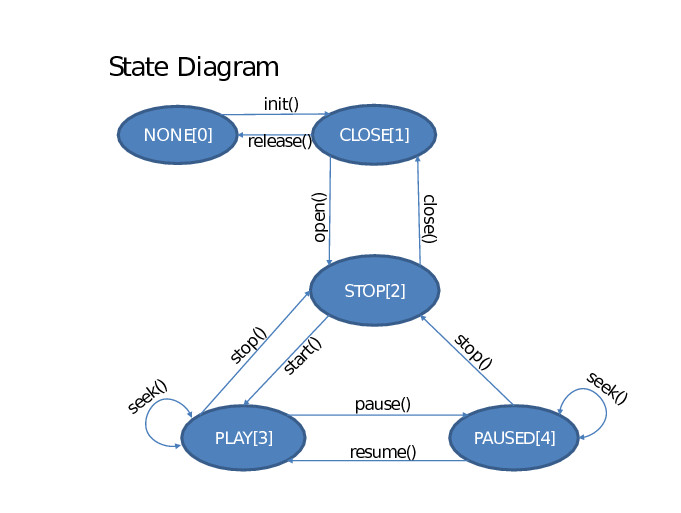
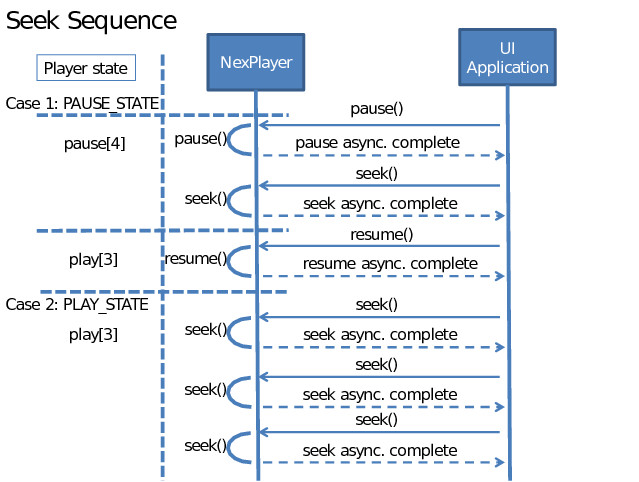

# Setup Guide

Through this guide, you will be introduced to the basic steps for setting up the playback.

## Importing SDK

The first thing you have to do is to import the SDK provided by NexPlayer, into your project.

**Source files**  

Go to your project in Android Studio, and create a new package called `com.nexstreaming.nexplayerengine`.  


Once you have the package, go to your file explorer and copy all the files from the `SDK/src/` folder into the package you have just created. It should be in the following directory `PROJECT_ROOT/src/com/nexstreaming/nexplayerengine`

**Libraries**  

Put all the folders containing the .so libraries from the downloaded SDK `SDK/libs` inside `app/libs` folder. 

**Gradle**

It's necessary to update the **gradle** file of the module where you are including the NexPlayer SDK with the following code.

```
android {
	defaultConfig {
		...
	}
	
	buildTypes {
		...
	}
	
	// Include in gradle
	sourceSets {
		main {
			jniLibs.srcDirs = ['libs']
		}
	}
}
```

The *minSdkVersion* NexPlayer allow is 16.  Java version, inside compileOptions, should be 1.7 or higher.  

```
sourceCompatibility JavaVersion.VERSION_1_7
targetCompatibility JavaVersion.VERSION_1_7
```

**Manifest permissions**  

You will need to set up some permissions in your AndroidManifest.xml in order to use urls content.

```xml
<uses-permission android:name="android.permission.INTERNET" />
<uses-permission android:name="android.permission.ACCESS_WIFI_STATE" />
```

**Sample app**

In the sample project, you will be able to check any doubts you may have during development, also you can use it to check all of the different options you can use while using the player.


## Integrating NexVideoView

NexVideoView class allows you to easily display video in your application. 

First, initialise the renderer:

```java 
NexVideoRenderer renderer = new NexVideoRenderer(context);
```

Set the layout:

```java
videoLayout.addView(renderer, 0);
LayoutParams rendParams = new LayoutParams(MATCH_PARENT,MATCH_PARENT);
renderer.setLayoutParams(rendParams);
```

Bind nexPlayer object to to videoView:


## Listening the Player Events

You can listen the player events with the NexEventReceiver class:

```java
mNexPlayer.setListener(new NexEventReceiver() {
	//Override methods
});
```


### onError

Called when an error is thrown by the player.

```java
@Override
public void onError(NexPlayer mp, NexPlayer.NexErrorCode errorcode) {
	Log.d("NexVideoPlayer", "NexVideoPlayer Error: " + errorcode.getDesc());
}
```

### onAsyncCmdComplete

When an asynchronous method of NexPlayer has been completed successfully or failed, this method is called receiving the respective information of what happened.

Using this class you can control the life cycle of the player, some methods should not be called until the previous has finished, for example *start* must be always be called after *open* is completed.

```java
@Override
public void onAsyncCmdComplete(NexPlayer mp, int command, int result, int param1, int param2) {
	Log.e("NexVideoPlayer", "onAsyncCmdComplete - result() : " + result);
	
	if (command == NexPlayer.NEXPLAYER_ASYNC_CMD_OPEN_STREAMING) {
		if (result == 0) {
			// Success
			// You can call start now directly from here
		}
	} 
	else if (command == NexPlayer.NEXPLAYER_ASYNC_CMD_STOP) {
		Log.d("NexVideoPlayer", "Video Stopped" + String.valueOf(_index + 1));
	} 
	else if (command == NexPlayer.NEXPLAYER_ASYNC_CMD_START_STREAMING) {
		Log.d("NexVideoPlayer", "Video Resumed" + String.valueOf(_index + 1));
	}
}
```

## Controlling the Playback

Playback is controlled through the **NexPlayer** class, which handles the acquisition and decoding of the media data.

The application creates an instance of this class and issues commands to it by calling instance methods. NexPlayer carries out these commands asynchronously and notifies the application of changes in status.

```java
mNexPlayer = new NexPlayer();

// NexVideoRenderer renderer
renderer.init(mNexPlayer);
renderer.setVisibility(View.VISIBLE);

mNexPlayer.setListener(new NexEventReceiver{
	// override methods
});
```

Once this is done, the application may call the methods on the NexPlayer object to control the media source. Certain calls, such as *open* and *close* must be given in matched pairs. The basic structure of calls for media playback is as follows:

- NexPlayer.open()  
	- NexPlayer.start()  
		- NexPlayer.pause()
		- NexPlayer.seek()
		- NexPlayer.resume()
	- NexPlayer.stop()
- NexPlayer.close()
  

#### Open Command

This method initializes the media at the specified path or URL.

`nexPlayer.open(String: path, String: smiPath, String: externalPDPath, int: type, int: transportType)`

* **path**: The location of the content, a path (for local content) or URL (for remote content)  
* **smiPath**: The path to a local subtitle file, the URL to load a subtitle file, or null for no subtitles.  
* **externalPDPath**: When not null, the external path used to play PD content downloaded by the Downloader module.  
* **type**: Determines how the path argument is interpreted.  
> NEXPLAYER_ SOURCE_ TYPE_ LOCAL_ NORMAL: To play local media  
> NEXPLAYER_ SOURCE_ TYPE_ STREAMING: To play remote media  
> NEXPLAYER_ SOURCE_ TYPE_ STORE_ STREAM: To store remote media content   

* **transport type**: The network transport type to use on the connection. (TCP / UDP)

```
mNexPlayer.open(url, 
				null, 
				null, 
				NexPlayer.NEXPLAYER_SOURCE_TYPE_STREAMING, 
				NexPlayer.NEXPLAYER_TRANSPORT_TYPE_TCP
);
```


#### Start Command

Starts playing media from the specified timestamp. The media must have already been succesfully opened with `open()` command. This method only works for media that is in the stopped state. For changing the position of the media that is on pause or playing states use seek().

`nexPlayer.start(int: msec)`

* **msec**: The offset (milliseconds) from the beginning of the media at wich start playback. Should be 0 to start at the beginning.  This parameter must be set to a valid value within the seekable range that can be obteined using `getSeekableRangeInfo()`.

```java
mNexPlayer.start();
```

#### Pause Command

This method pauses the current playback. Returns zero for success, or a non-zero error code in the event of a failure.

```java
mNexPlayer.pause();
```

#### Resume Command

This method resumes playback beginning at the point at which the player was last paused.  
Zero for success, or a non-zero error code in the event of a failure.

```java
mNexPlayer.resume();
```

#### Seek Command

This function seeks the playback position exactly to a specific time.  This does not work if NexPlayer state is stopped or if the stream does not support seeking.  

* **msec**: The offset in milliseconds from the beginning of the media to which the playback position should seek.  

Returns zero on success, or a non-zero error code in the event of a failure.

```java
mNexPlayer.seek(0);
```

#### Stop Command

This function stops the current playback.  Returns zero for success, or a non-zero error code in the event of a failure.

```java
mNexPlayer.stop();
```


#### Close Command

This method ends all the work on the content currently open and terminates the SDK work. The content must be stopped **before** calling this method. The correct way to finish playing content is to either wait for the end of content or to call stop and wait for the stop operation to complete, then call *close*.  

It returns zero for success, or a non-zero error code in the event of a failure.

```java
mNexPlayer.close();
```


### Handling the Player States

NexPlayer handles state-changing API functions asynchronously. The player’s state will not be changed immediately even if the API is called. Therefore, UI applications should check the player’s state using **getState** before calling the API. After calling any state-changing API function, UI applications must wait for the onAsyncCmdComplete message from the player before calling any further state-changing API functions.

NexPlayer has five possible states:

- `NEXPLAYER_STATE_NONE`
- `NEXPLAYER_STATE_CLOSED`
- `NEXPLAYER_STATE_STOP`
- `NEXPLAYER_STATE_PLAY`
- `NEXPLAYER_STATE_PAUSE`



- Requests for NexPlayer to open, seek, pause, stop and resume are placed in a queue and handled in the order they are received.
- When a queued operation completes, NexPlayer will notify the application by calling the **onAsyncCmdComplete** method in the listener.
- Some of the requests can take significant time to complete (depending on various factors, for example, network conditions). Therefore, the recommended practice is for the application to issue only one request at a time and wait for that request to complete.


#### Seek Sequence Example


In order to provide the best user experience, after calling seek command, the application should wait for the associated `onAsyncCmdComplete` callback before calling `seek()` again. In the meantime, if the user continues to request seek operations (such as by dragging a seek bar in the user interface), the application should remember only the most recent seek request and issue that request after receiving `onAsyncCmdComplete`.

**Seek Function**

```java
if (mBoolSeekStarted) {
	mSeekToTime = position;
}
else {
	mBoolSeekStarted = true;
	iRet = mNexPlayer.seek(position);

	if(iRet != ERROR_NONE) {
		mBoolSeekStarted = false;
	}
}
```

**AsyncCmdComplete Function**
	
```java
case NexPlayer.NEXPLAYER_ASYNC_CMD_SEEK:
	if (mBoolSeekStarted) {
		iRet = mNexPlayer.seek(mSeekToTime);
		if(iRet != ERROR_NONE) {
			mSeekToTime = 0;
			mBoolSeekStarted = false;
		}
	else {
		mBoolSeekStarted = false;
	}
```
	


## Properties

It is possible to set certain properties on the NexPlayer instance, which affect how media is played back, how audio/video synchronization is handled, which player features are enabled, and so on. In general, the default property settings are suitable for most applications. However, if you are developing a streaming media application that uses HLS (HTTP Live Streaming), you may want to adjust the buffering time.

For more information on properties, see **NexProperty**.

#### Log Level
The logging level for the NexPlayer protocol module. This affects the type of messages that are logged by the protocol module.  
The possible values for the Log Level are:  

- `LOG_LEVEL_NONE`
- `LOG_LEVEL_DEBUG`  
- `LOG_LEVEL_RTP`  
- `LOG_LEVEL_RTCP`  
- `LOG_LEVEL_FRAME`  
- `LOG_LEVEL_ALL`
 
By default its set *Debug*

```java
mNexPlayer.setProperty(NexProperty.LOG_LEVEL, NexProperty.LOG_LEVEL_ALL);
```
