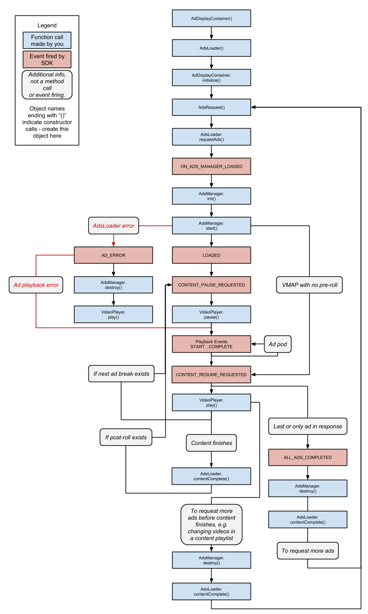
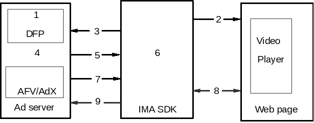
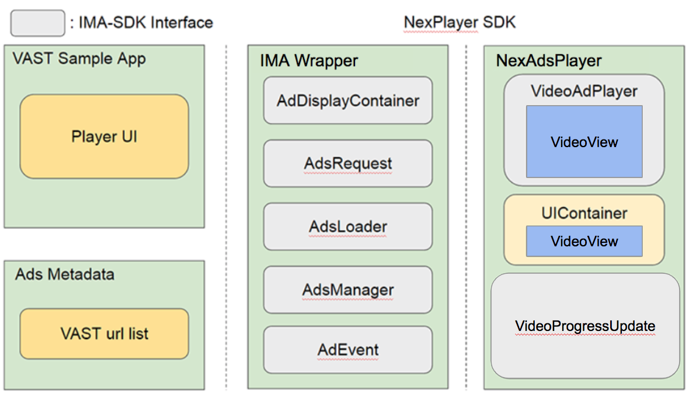
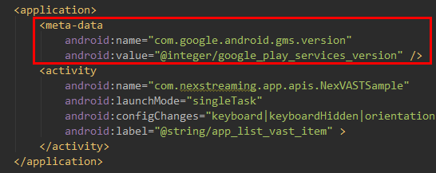

# VAST integration with NexPlayer SDK for Android

VAST is a Video Ad Serving Template for structuring ad tags that serve ads to video players. Using an XML schema, VAST transfers important metadata about an ad from the ad server to a video player. Initially launched in 2008, VAST has since played an important role in the growth of the digital video marketplace. Link:http://www.iab.com/guidelines/digital-video-ad-serving-template-vast-4-0/

The Interactive Media Ads (IMA) SDKs enable publishers to display ads into video, audio, and game content. This SDK provides a set of APIs to make video ad requests to any VAST-compliant ad server, inperpret the ad responses, report metrics to the ad servers, support players in handling ad playback, and incorporate key buying signals such as Active View viewability, IDFA/ADID, content targeting, and more. Link: https://developers.google.com/interactive-media-ads/ 

NexPlayer SDK provides a module which enables customers to playback content with VAST ads. Although developers can integrate the IMA-SDK with the NexPlayer SDK, we strongly recommend using the pre-integrated SDK. Handling IMA-SDK features to playback the VAST templete will be easier and more efficient with the 
NexPlayer SDK exclusive features.

## VAST Integration Components

- Interactive Media Ads (IMA) Components

 - (a)  **IMA-SDK Lifecycle**
	This diagram shows the full lifecycle of the IMA-SDK. Constructor and method calls are highlighted in
blue, events in red, and error conditions are shown with red arrows and red text. Use this as a reference
as you work through your IMA implementation. Link: Google Developers https://developers.google.com/interactive-media-ads/docs/sdks/android/lifecycle



*Figure 1.1: IMA SDK Lifecycle*

 - (b) **Interactions among Video Player, the IMA-SDK, and an Ad serve** The following diagram illustrates and annotates the interactions among your video player, the IMA-SDK v3, and an ad server. It helps you visualize how things will work when you finish implementing your integration with the SDK. Link: Google Developers https://developers.google.com/interactive-media-ads/docs/sdks/android/basic-interactions



*Figure 1.2: Basic IMA SDK Interactions*

- 2. NexPlayer with VAST Components




*Figure 1.3: NexPlayer with VAST Components*

 - (a) NexAdsPlayer is a wrapping class of VideoAdPlayer, VideoProgressUpdate, and UIContainer.
 - (b) VideoAdPlayer is a ad player of IMA-SDK.
 - (c) The UIContainer is set with VideoView.
 - (d) VideoProgressUpdate can be implemented with the duration of ad player.

### Basic VAST Sample Guide

This guide will show how to integrate the NexIMAWrapper into a VAST sample video player application. It is required to set the VideoView when create NexIMAWrapper with some conditons.

- 1. Conditions
 - (a) Include Google Play service in your application following (Reference- Google Developers: Setting Up Google Play Services https://developers.google.com/android/guides/setup) and add the following to your application-level ‘build.gradle’ file.

 ```
dependencies {
vastCompile ’com.google.ads.interactivemedia.v3:interactivemedia:3.9.4’
vastCompile ’com.google.android.gms:play-services-ads:15.0.1’
}
```

 - (b) Add the following ‘<meta-data>’ code to your ‘<AndroidManifest.xml>’ inside the ‘application’ tag.



*Figure 1.4: Setting metadata*


- 2. Basic steps

 - (a) After checking the above conditions, you should create NexIMAWrapper class to handle VAST ad requests from IMA-SDK and respond to IMA-SDK events. 
 - (b) NexIMAWrapper implements several interfaces from the IMA-SDK to track VAST ad events AdErrorEvent.AdErrorListener, AdsLoader.AdsLoadedListener, and AdEvent.AdEventListener.


 ```java
public class NexIMAWrapper implements AdErrorEvent.AdErrorListener, 
AdsLoader.AdsLoadedListener, AdEvent.AdEventListener {
...
}
```

 - (c) VAST Controller should be created after NexPlayer.init() is called.

 ```java
@Override
protected void onCreate(Bundle icicle) {

	mNexPlayer = new NexPlayer();
	mNexALFactory = new NexALFactory();
	...
	mNexALFactory.init(...);
	mNexPlayer.setNexALFactory(...);
	mNexPlayer.init(this, mPrefData.mLogLevel);
	...
	mNexVASTController = new NexIMAWrapper(context, ViewGroup, false);
	...
}
```

 - (d) To create NexIMAWrapper, context and ViewGroup is needed.
 - (e) In NexIMAWrapper constructor, NexAdsPlayer instance is created internally, and implements listener interfaces so the IMA-SDK can be notified when your video content finishes or not with an error.
 - (f) If NexIMAWrapper gets a notification of content completion, or an error from NexAdsPlayer, NexIMAWrapper calls AdsLoader.contentComplete() to notify IMA-SDK.
 - (g) After created NexIMAWrapper, you should set the listeners and actions of VAST.
 - (h) It is strongly recommended to set the NexIMAWrapper.play() into onAdsLoaded().

```java
mNexVASTController.setAdsReadyListener( new NexIMAWrapper.AdsReadyListener() {
	@Override
	public void onAdsLoaded() {
		...
		mNexVASTController.play(0);
		...
	}
	
	@Override
	public void onAdsLoadError(AdError error) {
		...
	}
});

mNexVASTController.setAdsContentEventListener(new NexIMAWrapper.AdsMediaEventListener() {
	@Override
	public void onAllCompletion(NexPlayer mp) {
		...
	}
	@Override
	public void onContentPauseRequested() {
		...
	}
	@Override
	public void onContentResumeRequested() {
		...
	}
	@Override
	public void onAdLoaded(boolean isLinear, int adPosition, int adCountInGroup, double adDuration, int
	adGroupidx) {
		...
	}
	@Override
	public void onAdCompleted() {
		...
	}
	@Override
	public void onAdStarted(boolean isSkippable, double skipTimeOffset){
		...
	}
});

mNexVASTController.setNexPlayerErrorListener(new NexIMAWrapper.OnErrorListener() {
	@Override
	public void onError(NexPlayer mp, NexPlayer.NexErrorCode errorCode) {
		...
	}
	});
	mNexVASTController.setAdPointsListener(new NexIMAWrapper.AdPointsListener() {
	@Override
	public void onAdPointsLoaded(int[] adPoints) {
		...
	}
	@Override
	public void onAdUrlLoaded(int startTime, String adUrl){
		...
	}
});

mNexVASTController.setContentPlayer(mNexPlayer);
mNexVASTController.prepareVAST(mVASTUrl);
```

 - (i) Right after the listener setting is done, you should call NexIMAWrapper.setContentPlayer() with NexPlayer object to control NexPlayer in NexIMAWrapper.
 - (j) Call the NexIMAWrapper.prepareVAST() with parameter value of AD url.
 - (k) In addition, optionally, you can control the VAST Player action following with Android life cycle.

```java

@Override
protected void onPause() {
	super.onPause();
	if (mNexVASTController != null) {
		mNexVASTController.pause();
	}
}

@Override
protected void onResume() {
	super.onResume();
	
	if (mNexVASTController != null) {
		mNexVASTController.resume();
	}
}

@Override
protected void onDestroy() {
	super.onDestroy();
	if (mNexVASTController != null)
		mNexVASTController.release();
}
```

## Class Documentation

### NexIMAWrapper.AdPointsListener Interface Reference

This interface can be implemented in an application in order to receive AD point events from NexIMAWrapper.

#### void onAdPointsLoaded (int[] adPoints)

This method indicates when point of ADs is successfully loaded.

**Parameters**

| Name  | Description  | 
|---|---|
|adPoints| Array of point of ADs while generating the event.|

#### void onAdUrlLoaded(int startTime,String adUrl)

This method indicates when AD url and start time are successfully loaded.

**Parameters**

| Name  | Description  | 
|---|---|
|startTime| Start time while generating the event.|
|adUrl| AD url while generating the event.|

### NexIMAWrapper.AdsMediaEventListener Interface Reference

This interface can be implemented in an application in order to receive ADs media events from NexVastController;

#### void onAdLoaded(boolean isLinear, int adPosition, int adCountInGroup, double adDuration, int mAdGroupidx)

This method indicates when AD is loaded.

**Parameters**

| Name  | Description  | 
|---|---|
|isLinear |Determine the AD is linear or not.|
|adPosition |Position of AD.|
|adCountInGroup| The number of ADs in AD group.|
|adDuration| The duration of AD.|
|mAdGroupidx| The index of AD groups.|

#### void onAllCompletion(NexPlayer mp)

This method indicates when playback is successful up to the end of the content.

**Parameters**

| Name  | Description  | 
|---|---|
|mp| The NexPlaye object generating the event.|

### NexIMAWrapper.AdsReadyListener Interface Reference

This interface can be implemented in an application in order to receive ads ready events from NexIMAWrapper.

**Public Member Functions**

- `void onAdsLoaded()`
    This method indicates when ADs are successfully loaded.
- `void onAdsLoadError(AdError error)`
    This method indicates when getting errors.

### NexIMAWrapper Class Reference

Ads logic for handling the IMA SDK integration code and events.

**Classes**

- `interface AdPointsListener`
    This interface can be implemented in an application in order to receive AD point events from NexIMAWrapper.
- `interface AdsMediaEventListener`
    This interface can be implemented in an application in order to receive ADs media events from NexVastController;.
- `interface AdsReadyListener`
    This interface can be implemented in an application in order to receive ads ready events from NexIMAWrapper.
- `interface OnErrorListener`
    This interface can be implemented in an application in order to receive error events from NexIMAWrapper.


#### NexIMAWrapper(Context context,ViewGroup view)

Sole constructor for NexIMAWrapper.

After constructing a NexIMAWrapper object, youmustcall NexIMAWrapper.setContentPlayer before you can call
any other methods

**Parameters**

| Name  | Description  | 
|---|---|
|context| Context "
|view| Container for ad player.|


#### AdsManager getAdsManager()

Return AdsManager for User control.

This method can be used after calling NexIMAWrapper.onAdsManagerLoaded

#### void onAdError (AdErrorEvent adErrorEvent)

An event raised when there is an error loading or playing ads.

**Parameters**

| Name  | Description  | 
|---|---|
|adErrorEvent| Possible error event of AdErrorEvent class.|

#### void onAdEvent (AdEvent adEvent)

Responds to AdEvents.

**Parameters**

| Name  | Description  | 
|---|---|
|adEvent| Possible event of AdEvent class.|

#### void onAdsManagerLoaded ( AdsManagerLoadedEvent adsManagerLoadedEvent)

An event raised when ads are successfully loaded from the ad server via an AdsLoader.

**Parameters**

| Name  | Description  | 
|---|---|
|adsManagerLoadedEvent|Loaded event from AdsManager.|

#### void play (int startTime)

Starts contents playback.

**Parameters**

| Name  | Description  | 
|---|---|
|startTime| The offset (in milliseconds) from the beginning of the media.|

#### void prepareVAST (String vastUrl)

Set VAST url.

**Parameters**

| Name  | Description  | 
|---|---|
|vastUrl| url of the ad’s VAST XML.|

#### void setAdPointsListener AdPointsListener listener)

Set point of playing Ad.

**Parameters**

| Name  | Description  | 
|---|---|
|listener| NexVideoView.OnCompletionListener.|

#### void setAdsContentEventListener (AdsMediaEventListener listener)

Set Content and Ad complete listener.

**Parameters**

| Name  | Description  | 
|---|---|
|listener| NexVideoView.OnCompletionListener.|

#### void setAdsReadyListener (AdsReadyListener listener)

Set Content and Ad complete listener.

**Parameters**

| Name  | Description  | 
|---|---|
|listener| NexVideoView.OnCompletionListener."

#### void setContentPlayer ( NexPlayer nexplayer)

Set NexPlayer.

**Parameters**

| Name  | Description  | 
|---|---|
|nexplayer|Nex Player|

#### void setNexPlayerErrorListener (OnErrorListener listener)

Set content error listener.

**Parameters**

| Name  | Description  | 
|---|---|
|listener| NexVideoView.OnErrorListener.|

### NexIMAWrapper.OnErrorListener Interface Reference

This interface can be implemented in an application in order to receive error events from NexIMAWrapper.

#### void onError (NexPlayermp,NexPlayer.NexErrorCode errorCode)

An error has occurred during playback.

**Parameters**

| Name  | Description  | 
|---|---|
|mp | The NexPlayer object generating the event.|
|errorCode| The error code for the generated error.|
